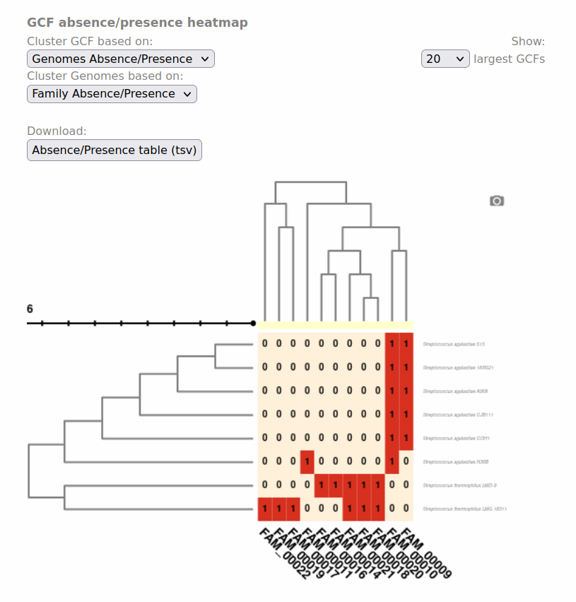
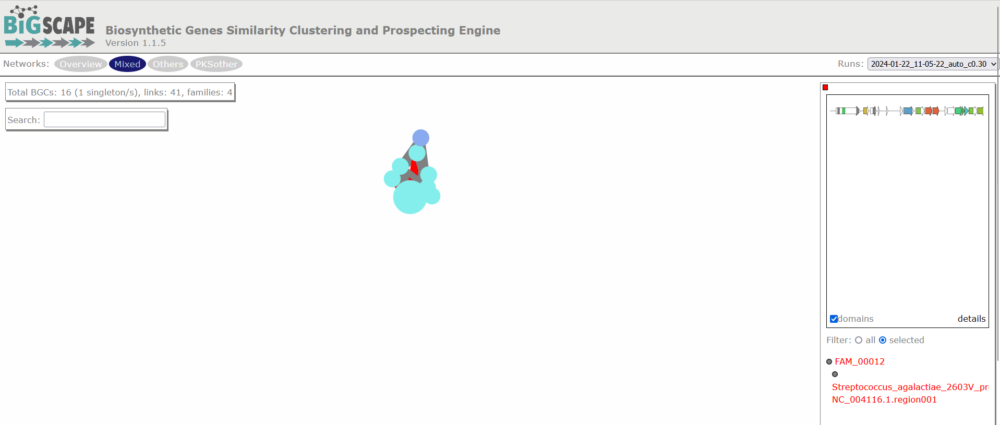
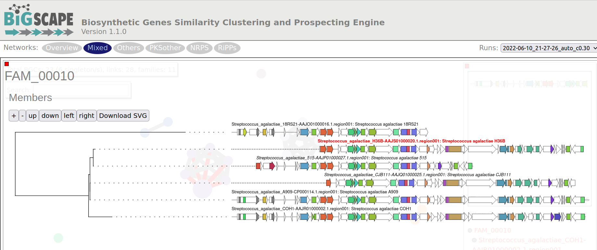

## Introduction

In the previous section, we learned how to study the BGCs 
encoded by each of the genomes of our analyses. In case you are 
interested in the study of a certain BGC or a certain strain, 
this may be enough. However, sometimes the aim is to 
compare the biosynthetic potential of tens or hundreds of 
genomes. To perform this kind of analysis, we will use 
BiG-SCAPE (Navarro-Muñoz et al., 2019), a workflow that 
compares all the BGCs detected by antiSMASH to find their 
relatedness. BiG-SCAPE will search for Pfam domains (Mistry et 
al., 2021) in the protein sequences of each BGC. Then, the Pfam 
domains will be linearized and compared, creating different 
similarity networks and scoring the similarity of each pair of 
clusters. Based on a cutoff value for this score, the diverse BGCs
will be classified on Gene Cluster Families (GCFs) to facilitate 
their study. A single GCF is supposed to encompass BGCs that produce 
chemically related metabolites (molecular families). Lower cutoffs
would create families of BGCs that produce identical compounds, while higher 
cutoffs would create families of more loosely related compounds.

## Preparing the input

In each of the antiSMASH output directories, we will find a single `.gbk`
 file for each BGC, which includes "region" within its filename. Thus, 
 we will copy all these files to the new directory.

Move into the directory that has the antiSMASH results of each genome:
~~~
$ conda deactivate  
$ conda activate bigscape  
$ cd ~/gm_workshop/results/antismash/
$ ls
$ mv  thermophilusLMD9.prokka  Streptococcus_thermophilus_LMD9.prokka
$ mv thermophilusLMG18311.prokka  Streptococcus_thermophilus_LMG18311.prokka
~~~
{: .language-bash}

Since we will put together in the same directory many files with similar names, we want to 
make sure that nothing is left behind or overwritten. For this, we
 will count all the `gbk` files of all the genomes.
~~~
$ ls Streptococcus*/*region*gbk | wc -l
~~~
{: .language-bash}

~~~
24
~~~
{: .output}

Since the names are somewhat cryptic, they could be repeated,
 so we will rename the `gbks` in such a way that they include the genome name.

Copy the following script to a file named `change-names.sh` using `nano`:
~~~
# This script is to rename the antiSMASH gbks for them to include the species and strain names, taken from the directory name.
# The argument it requires is the name of the directory with the AntiSMASH output, which must NOT contain a slash at the end.

# Usage for one AntiSMASH output directory:
# 	sh change-names.sh <folder>

# Usage for multiple AntiSMASH output directory:
# 	for species in <output-directory-pattern*>
# 		do
# 			sh change-names.sh $species
# 		done

ls -1 "$1"/*region*gbk | while read line # enlist the gbks of all regions in the directory and start a while loop
 do
	dir=$(echo $line | cut -d'/' -f1) # save the directory name in a variable 
	file=$(echo $line | cut -d'/' -f2) # save the file name in a variable
    for directory in $dir # start a for loop
        do
        	cd $directory # enter the directory
          newfile=$(echo $dir-$file) # make a new variable that fuses the directory name with the file name
 			    echo "Renaming" $file " to" $newfile # print a message showing the old and new file names
 			    mv $file $newfile # rename
 			    cd .. # return to main directory befor it beggins again
 		done
 done
~~~
{: .language-bash}

Run the script for all the directory:
~~~
$ for species in Streptococcus*
> do
>		sh change-names.sh $species
>	done

~~~
{: .language-bash}

Now make a directory for all your BiG-SCAPE analyses and inside it 
make a directory that contains all of the `gbks` of all of your genomes. 
This one will be the input for BiG-SCAPE. (For convenience `bigscape/` will be inside `antismash/` while we run BiG-SCAPE).
~~~
$ mkdir -p bigscape/bgcs_gbks/
~~~
{: .language-bash}

Now copy all the region `gbks`to this new directory, and look at its content:
~~~
$ cp Streptococcus_*/*region*gbk bigscape/bgcs_gbks/
$ ls bigscape/bgcs_gbks/
~~~
{: .language-bash}

~~~
Streptococcus_agalactiae_18RS21-AAJO01000016.1.region001.gbk
Streptococcus_agalactiae_18RS21-AAJO01000043.1.region001.gbk
Streptococcus_agalactiae_18RS21-AAJO01000226.1.region001.gbk
Streptococcus_agalactiae_515-AAJP01000027.1.region001.gbk
Streptococcus_agalactiae_515-AAJP01000037.1.region001.gbk
Streptococcus_agalactiae_A909-CP000114.1.region001.gbk
Streptococcus_agalactiae_A909-CP000114.1.region002.gbk
Streptococcus_agalactiae_CJB111-AAJQ01000010.1.region001.gbk
Streptococcus_agalactiae_CJB111-AAJQ01000025.1.region001.gbk
Streptococcus_agalactiae_COH1-AAJR01000002.1.region001.gbk
Streptococcus_agalactiae_COH1-AAJR01000044.1.region001.gbk
Streptococcus_agalactiae_H36B-AAJS01000020.1.region001.gbk
Streptococcus_agalactiae_H36B-AAJS01000117.1.region001.gbk
Streptococcus_thermophilus_LMD-9-CP000419.1.region001.gbk
Streptococcus_thermophilus_LMD-9-CP000419.1.region002.gbk
Streptococcus_thermophilus_LMD-9-CP000419.1.region003.gbk
Streptococcus_thermophilus_LMD-9-CP000419.1.region004.gbk
Streptococcus_thermophilus_LMD-9-CP000419.1.region005.gbk
Streptococcus_thermophilus_LMG_18311-NC_006448.1.region001.gbk
Streptococcus_thermophilus_LMG_18311-NC_006448.1.region002.gbk
Streptococcus_thermophilus_LMG_18311-NC_006448.1.region003.gbk
Streptococcus_thermophilus_LMG_18311-NC_006448.1.region004.gbk
Streptococcus_thermophilus_LMG_18311-NC_006448.1.region005.gbk
Streptococcus_thermophilus_LMG_18311-NC_006448.1.region006.gbk
~~~
{: .output}

## Running BiG-SCAPE

BiG-SCAPE can be executed in different ways, depending on the installation mode that you applied.
You could call the program through `bigscape`, `run_bigscape`or `run_bigscape.py`. Here, based on our
installation (see [Setup](setup.html)), we will use `run_bigscape`. 

The options that we will use are described in the help page:

~~~
-i INPUTDIR, --inputdir INPUTDIR
                        Input directory of gbk files, if left empty, all gbk
                        files in current and lower directories will be used.

-o OUTPUTDIR, --outputdir OUTPUTDIR
                        Output directory, this will contain all output data
                        files.

--mix                 By default, BiG-SCAPE separates the analysis according
                       to the BGC product (PKS Type I, NRPS, RiPPs, etc.) and
                       will create network directories for each class. Toggle
                       to include an analysis mixing all classes
                       
--hybrids-off         Toggle to also add BGCs with hybrid predicted products
                        from the PKS/NRPS Hybrids and Others classes to each
                        subclass (e.g. a 'terpene-nrps' BGC from Others would
                        be added to the Terpene and NRPS classes)

--mode {global,glocal,auto}
                        Alignment mode for each pair of gene clusters.
                        'global': the whole list of domains of each BGC are
                        compared; 'glocal': Longest Common Subcluster mode.
                        Redefine the subset of the domains used to calculate
                        distance by trying to find the longest slice of common
                        domain content per gene in both BGCs, then expand each
                        slice. 'auto': use glocal when at least one of the
                        BGCs in each pair has the 'contig_edge' annotation
                        from antiSMASH v4+, otherwise use global mode on that
                        pair

~~~
{: .language-bash}

We will use the option `--mix` to have an analysis of all of the BGCs together besides 
the analyses of the BGCs separated by class. The `--hybrids-off` option will prevent 
from having the same BGC twice (in the case of hybrid BGCs that could belong to two classes)
in our results. And since none of the BGCs is on a contig 
edge, we could use the global mode. However, frequently, when analyzing draft genomes, this 
is not the case. Thus, the auto mode will be the most appropriate, which will use the global 
mode to align domains except for those cases in which the BGC is located near to a contig end, 
for which the glocal mode is automatically selected. For this run we will use only the default 
cutoff value (0.3).

Now we are ready to run BiG-SCAPE:
~~~
$ bigscape -i bigscape/bgcs_gbks/ -o bigscape/output_100622 --mix --hybrids-off --mode auto --pfam_dir /opt/anaconda3/envs/bigscape/Pfam_database
~~~
{: .language-bash}

> ## Output names
>
> Most of the times you will need to re-run a software once you have explored the results; 
> maybe you want to change parameters or add more samples. For this reason, you will need 
> a flexible way to organize your proyect, including the names of the outputs.
> Usually, a good idea is to put the date in the name of the folder 
> and keep track of the analyses you are running in your research notes.
>
{: .callout}

Once the process is finished, you will find in your terminal screen some basic results, 
such as the number of BGCs included in each type of network. In the output folder 
you will find all the data.  
Since BiG-SCAPE does not produce a file with the run information, it is useful 
to copy the text printed on the screen to a file. Use `nano` to paste all the text 
that BiG-SCAPE generated in a file named `bigscape.log` inside the folder `output_100722/logs/`.

~~~
$ nano bigscape/output_100622/logs/bigscape.log
~~~
{: .language-bash}

Take a look at the BiG-SCAPE outputs:

~~~
$ ls -F bigscape/output_100622/
~~~
{: .language-bash}
~~~
cache/  html_content/  index.html*  logs/  network_files/  SVG/
~~~
{: .output}

To keep ordered your directories, move your `bigscape/` directory to `genome_mining/`:
~~~
$ mv bigscape/ ../
~~~
{: .language-bash}

And make a new folder called `scripts/` in the `gm-workshop/`directory to save our little script:
~~~
$ mkdir ~/gm_workshop/scripts
$ mv change-names.sh ~/gm_workshop/scripts/
~~~
{: .language-bash}

## Viewing the results

An easy way to prospect your results is by opening the `index.html` file with a browser 
(Firefox, Chrome, Safari, etc.). In order to do this, you need to go to your local machine 
and locate in the folder where you want to store your BiG-SCAPE results. Now copy your `output_100622/` 
folder to your local machine:

~~~
$ scp -r <serveradress>:~/gm_workshop/results/genome_mining/bigscape/output_100622/ .
~~~
{: .language-bash}

Open your `index.html` with a browser:
~~~
$ firefox output_100622/index.html # If you have Firefox available, otherwise open it using the GUI.
~~~
{: .language-bash}

There are diverse sections in the visualization. The following image shows the overview page. 
At the left there is the run information and there are pie chart representations of the number of BGCs 
per genome and per class. At the right there is the Network Overview for each of the BGC classes found and
the mix category. They show the Number of Families, 
Average number of BGCs per family, Max number of BGCs in a family and the Families with MIBiG Reference
BGCs. You can click on the name of the class to see its Network Overview.

Below, there is a clustered heatmap of the presence/absence of the
GCFs in each genome for each class. You can customize this heatmap and select the clustering methods, 
or the number of GCFs represented. 

Clicking any of the class names of the upper left bar displays a similarity 
network of BGCs. It may take some time to load the network. A single 
network is represented for each GCF or each Gene Cluster Clan (GCC), which 
may comprise several GCFs. Each dot represents a BGC. These dots with bold circles are already 
described BGCs that have been recruited from the MiBIG database (Kautsar et al., 2020) because 
of its similarity with some BGC of the analysis. 

When you click on a BGC (dot), it appears its GCF at the right. You can click on the GCF name to see the
phylogenetic distances among all the BGCs comprised by a single GCF. Within the tree there is an 
arrow diagram of the genes in the BGCs and the protein domains in the genes.
These trees are useful to prioritize the search of secondary metabolites, for example, by focusing on 
the most divergent BGC clade or those that are distant to already described BGCs.

> ## Discussion 1: Reading the GCF networks.
> 
> What can you conclude about the diversity of BGCs between _S. agalactiae_ and _S. thermophilus_? 
> Are they equally diverse? Do they share GCFs?
> 
> Digging deeper: Why do you think the strain _S. agalactiae_ H36B has a BGC that is not part of the other GCF in the same class?
> > ## Solution
> > _S. agalactiae_ and _S. thermophilus_ seem to have no diversity in common because there is no 
> > GCF with members from both species. 
> > All strains of _S.agalactiae_ seem to have a very similar set of BGCs. While _S. thermophilus_ 
> > has several BGCs that are not related to any other BGC.
> > 
> > Digging deeper: The BGC of the class PKSother in _S. agalactiae_ H3B6 has only 3 genes, which are also present in
> > the BGCs of the other GCF in this class. It is possible that these genes are in a fragmented part of the assembled genome, 
> > but are actually part of a BGC that is similar to the other ones. And it is also possible that these 3 genes are present in 
> > the genome without being part of a bigger BGC.
> {: .solution}
{: .challenge}

> ## Exercise 1: Using the text output.
> 
> Use one of the commands from the following list to make a reduced version of the `Network_Annotations_full.tsv`, 
> it should only contain the information of the type of product, the BGC class of each BGC, and its name. And save it in a file.
> 
> `grep` `cut` `ls` `cat` `mv`
> 
> **Tip**: The file is inside `network_files/`.
> 
> > ## Solution
> > 
> > We will first look at the content of the file:
> > 
> > ~~~
> > $ head -n 3 network_files/2022-06-10_21-27-26_auto/Network_Annotations_Full.tsv 
> > ~~~
> > {: .language-bash}
> > 
> > ~~~
> > BGC	Accession ID	Description	Product Prediction	BiG-SCAPE class	Organism	Taxonomy
> > Streptococcus_agalactiae_18RS21-AAJO01000016.1.region001	AAJO01000016.1	Streptococcus agalactiae
> > 18RS21	arylpolyene	Others	Streptococcus agalactiae 18RS21	Bacteria,Terrabacteria
> > group,Firmicutes,Bacilli,Lactobacillales,Streptococcaceae,Streptococcus,Streptococcus agalactiae
> > Streptococcus_agalactiae_18RS21-AAJO01000043.1.region001	AAJO01000043.1	Streptococcus agalactiae
> > 18RS21	T3PKS	PKSother	Streptococcus agalactiae 18RS21	Bacteria,Terrabacteria
> > group,Firmicutes,Bacilli,Lactobacillales,Streptococcaceae,Streptococcus,Streptococcus agalactiae
> > ~~~
> > {: .output}
> > 
> > We can see that the table is difficult to read because of the amount of information it has. The first line has the names of the 
> > columns; `BGC`, `Product Prediction` and `BiG-SCAPE class` are the once we are interested in. So we will extract those.
> > 
> > ~~~
> > cut -f 1,4,5 network_files/2022-06-10_21-27-26_auto/Network_Annotations_Full.tsv > type_of_BGC.tsv
> > cat type_of_BGCs.tsv
> > ~~~
> > {: .language-bash}
> > 
> > ~~~
> > BGC	Product Prediction	BiG-SCAPE class
> > Streptococcus_agalactiae_18RS21-AAJO01000016.1.region001	arylpolyene	Others
> > Streptococcus_agalactiae_18RS21-AAJO01000043.1.region001	T3PKS	PKSother
> > Streptococcus_agalactiae_515-AAJP01000027.1.region001	arylpolyene	Others
> > Streptococcus_agalactiae_515-AAJP01000037.1.region001	T3PKS	PKSother
> > .
> > .
> > .
> > ~~~
> > {: .output}
> {: .solution}
{: .challenge}

## Cytoscape visualization of the results

You can also customize and re-renderize the similarity networks of your results with Cytoscape (https://cytoscape.org/). To do so, you will need some files included in the output directory of BiG-SCAPE. Both are located in the same folder. You can choose any folder included in the Network_files/(date)hybrids_auto/ directory, depending on your interest. The "Mix/" folder represents the complete network, including all the BGCs of the analysis. There, you will need the files "mix_c0.30.network" and "mix_clans_0.30_0.70.tsv". When you upload the ".network" file, it is required that you select as "source" the first column and as "target" the second one. Then, you can upload the ".tsv" and just select the first column as "source". Finally, you need to click on Tools -> merge -> Networks -> Union to combine both GCFs and singletons. Now you can change colors, labels, etc. according to your specific requirements.

### References
- Navarro-Muñoz, J.C., Selem-Mojica, N., Mullowney, M.W. et al. "A computational framework to explore large-scale biosynthetic diversity". Nature Chemical Biology (2019).

- Mistry, J., Chuguransky, S., Williams, L., Qureshi, M., Salazar, G. A., Sonnhammer, E. L., ... & Bateman, A. (2021). Pfam: The protein families database in 2021. Nucleic Acids Research, 49(D1), D412-D419.

- Kautsar, S. A., Blin, K., Shaw, S., Navarro-Muñoz, J. C., Terlouw, B. R., van der Hooft, J. J., ... & Medema, M. H. (2020). MIBiG 2.0: a repository for biosynthetic gene clusters of known function. Nucleic acids research, 48(D1), D454-D458.



