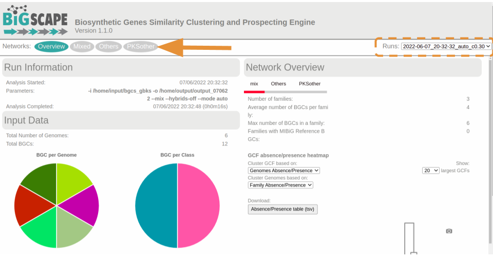
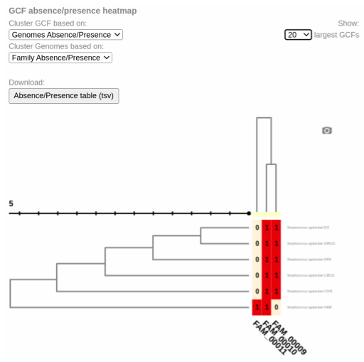
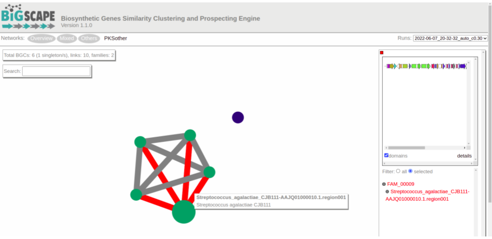
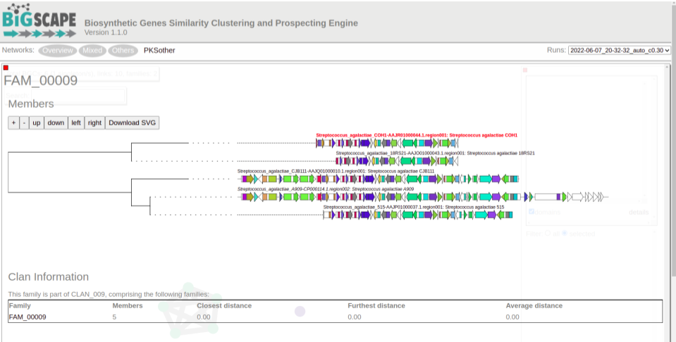

## Introduction

In the previous section, we learnt how to study the BGCs 
encoded by each of the genomes of our analyses. In case you are 
interested in the study of a certain BGC or a certain strain, 
this may be enough. However, sometimes the researcher aims to 
compare the biosynthetic potential of tens or hundreds of 
genomes. To perform this kind of analysis, we will use 
BiG-SCAPE (Navarro-Muñoz et al., 2019), a workflow that will 
compare all the BGCs detected by antiSMASH to find their 
relatedness. BiG-SCAPE will search for Pfam domains (Mistry et 
al., 2021) in the protein sequences of each BGC. Then, the Pfam 
domains will be linearized compared, creating different 
similarity networks and scoring the similarity of each pair of 
clusters. Based on this, the diverse BGCs will be classified on 
Gene Cluster Families (GCFs) to facilitate their study. A 
single GCF is supposed to encompass BGCs that produce 
chemically related metabolites (molecular families).

Let's see how this analysis can be done:

## Preparing the input

In each of the antiSMASH output folders, we will find a single `.gbk`
 file for each BGC that includes "region" within its filename. Thus, 
 we will copy all those files to the new folder.

Let's locate in the folder that has the antiSMASH results of each genome:
~~~
pwd
~~~
{: .bash}

~~~
/home/betterlab/GenomeMining/datos/copia-antis-output
~~~
{: .output}

We will count all the `gbk` files of all the genomes.
~~~
ls Streptococcus_agalactiae_*/*region*gbk | wc -l
~~~
{: .bash}

~~~
13
~~~
{: .output}

Because the names are somewhat cryptic and they could be repeated,
 and because having the genome name at sight can be useful, we will
  rename the `gbks` for them to include the genome name.

Copy the following script to a file named `change-name.sh` using `nano`:
~~~
# This script is to rename the antiSMASH gbks for them to include the species and strain names, taken from the folder name.
# The argument it requires is the name of the folder with the AntiSMASH output, which must NOT contain a slash at the end.

# Usage for one AntiSMASH output folder:
# 	sh change-names.sh <folder>

# Usage for multiple AntiSMASH output folders:
# 	for species in <output folder pattern*>
# 		do
# 			sh change-names.sh $species
# 		done

ls -1 "$1"/*region*gbk | while read line # enlist the gbks of all regions in the folder and start a while loop
 do
	dir=$(echo $line | cut -d'/' -f1) # save the folder name in a variable 
	file=$(echo $line | cut -d'/' -f2) # save the file name in a variable
    for directory in $dir
        do
        	cd $directory # enter the folder
            newfile=$(echo $dir-$file) # make a new variable that fuses the folder name with the file name
 			echo "Renaming" $file " to" $newfile # print a message showing the old and new file names
 			mv $file $newfile # rename
 			cd .. # return to main folder befor it beggins again
 		done
 done
~~~
{: .bash}

Run the script for all the folders:
~~~
for species in Streptococcus_agalactiae_*
	do
 		sh change-names.sh $species
 	done

~~~
{: .bash}

Now make a folder for all of your BiG-SCAPE analysis and inside it 
make a folder that will contain all of the `gbks` of all of our genomes. 
This folder will be the input for BiG-SCAPE.
~~~
mkdir -p bigscape/bgcs_gbks/
~~~
{: .bash}

~~~
scp Streptococcus_agalactiae_*/*region*gbk bigscape/bgcs_gbks/
~~~
{: .bash}

~~~
ls bigscape/bgcs_gbks/
~~~
{: .bash}

~~~
Streptococcus_agalactiae_18RS21-AAJO01000016.1.region001.gbk
Streptococcus_agalactiae_18RS21-AAJO01000043.1.region001.gbk
Streptococcus_agalactiae_18RS21-AAJO01000226.1.region001.gbk
Streptococcus_agalactiae_515-AAJP01000027.1.region001.gbk
Streptococcus_agalactiae_515-AAJP01000037.1.region001.gbk
Streptococcus_agalactiae_A909-CP000114.1.region001.gbk
Streptococcus_agalactiae_A909-CP000114.1.region002.gbk
Streptococcus_agalactiae_CJB111-AAJQ01000010.1.region001.gbk
Streptococcus_agalactiae_CJB111-AAJQ01000025.1.region001.gbk
Streptococcus_agalactiae_COH1-AAJR01000002.1.region001.gbk
Streptococcus_agalactiae_COH1-AAJR01000044.1.region001.gbk
Streptococcus_agalactiae_H36B-AAJS01000020.1.region001.gbk
Streptococcus_agalactiae_H36B-AAJS01000117.1.region001.gbk
~~~
{: .bash}

## Executing BiG-SCAPE

BiG-SCAPE can be executed in different ways, depending on the installation mode that you applied. You could call the program through `bigscape`, `run_bigscape`or `run_bigscape.py`. Here, based on our installation (see Setup section) we will use `run_bigscape`. 

The options that we will use are described in the help page:

~~~
-i INPUTDIR, --inputdir INPUTDIR
                        Input directory of gbk files, if left empty, all gbk
                        files in current and lower directories will be used.

  -o OUTPUTDIR, --outputdir OUTPUTDIR
                        Output directory, this will contain all output data
                        files.

 --mix                 By default, BiG-SCAPE separates the analysis according
                        to the BGC product (PKS Type I, NRPS, RiPPs, etc.) and
                        will create network directories for each class. Toggle
                        to include an analysis mixing all classes

--hybrids-off         Toggle to also add BGCs with hybrid predicted products
                        from the PKS/NRPS Hybrids and Others classes to each
                        subclass (e.g. a 'terpene-nrps' BGC from Others would
                        be added to the Terpene and NRPS classes)

--mode {global,glocal,auto}
                        Alignment mode for each pair of gene clusters.
                        'global': the whole list of domains of each BGC are
                        compared; 'glocal': Longest Common Subcluster mode.
                        Redefine the subset of the domains used to calculate
                        distance by trying to find the longest slice of common
                        domain content per gene in both BGCs, then expand each
                        slice. 'auto': use glocal when at least one of the
                        BGCs in each pair has the 'contig_edge' annotation
                        from antiSMASH v4+, otherwise use global mode on that
                        pair

~~~
{: .bash}

Run BiG-SCAPE:
~~~
run_bigscape bigscape/bgcs_gbks/ bigscape/output_070622 --mix --hybrids-off --mode auto
~~~
{: .bash}

Once the process ends, you will find in your terminal screen some basic results, 
such as the number of BGCs included in each type of network. In the output folder 
you will find all the data.  
Since BiG-SCAPE does not produce a file with the run information, it is useful 
to copy the text printed on the screen to a file. Use `nano` to paste all the text 
that BiG-SCAPE generated in a file named `bigscape.log` inside the folder `output_060722/logs/`.

To keep order in you directories move your `bigscape/` folder to the parent folder:
~~~
mv bigscape/ ../
~~~
{: .bash}

Go to your local machine and locate yourself in a folder where you want to store your BiG-SCAPE results.

Copy your `output_070622/` folder to your local machine:

~~~
scp -r betterlab@132.248.196.38:/home/betterlab/GenomeMining/datos/bigscape/output_070622/ .
~~~
{: .bash}

Open your `index.html` with a browser:
~~~
firefox output_070622/index.html # If you have Firefox available
~~~
{: .bash}

An easy way to prospect your results is by opening the `index.html` file with a browser 
(Firefox, Chrome, Safari, etc.). There are diverse sections in the visualization. At the 
left it is represented the number of BGCs per genome and BGC-type (Fig. Xa). At the right 
side it is represented a clustered heatmap of your genomes based on the presence/absence of 
GCFs (Fig. Xb). You can customize this heatmap and select the clustering method (Fig. Xb1) 
or the number of GCFs represented. Also, there are some summary statistics included the at 
the top right of the overview screen (Fig. Xc).  

When you click on any of the options of the upper bar (Fig. Xd) it will appear a similarity 
network of BGCs (Fig. X). It may take some time to charge the network.  

Here, it is represented a single network for each GCF or each Gene Cluster Clan (GCC), which 
may comprise several GCFs. Each dot represents a BGC. Those dots with bold circles are already 
described BGCs that have been recruited from the MiBIG database (Kautsar et al., 2020) because 
of its similarity with some BGC of the analysis. When you click on a BGC (dot), it appears its 
GCF at the right. You can click on the GCF name to see the phylogenetic distances among all the 
BGCs comprised by a single GCF (Figure X).  

 Here, the BGC that represents the "center" of the GCF is labelled in red. These trees will be 
 useful to prioritize the search of secondary metabolites, for example, by focusing on the most 
 divergent BGC clade or those that are distant to already described BGCs.

## Cytoscape visualization of the results

You can also customize and re-renderize the similarity networks of your results with Cytoscape (https://cytoscape.org/). To do so, you will need some files included in the output directory of BiG-SCAPE. Both are located in the same folder. You can choose any folder included in the Network_files/(date)hybrids_auto/ directory, depending on your interest. The "Mix/" folder represents the complete network, including all the BGCs of the analysis. There, you will need a the files "mix_c0.30.network" and "mix_clans_0.30_0.70.tsv". When you upload the ".network" file, it is needed that you select as "source" the first column and as "target" the second one. Then, you can upload the ".tsv" and just select the first column as "source". Finally, you need to click on Tools -> merge -> Networks -> Union to combine both GCFs and singletons. Now you can change colors, labels, etc. according to your specific requirements.

Questions

- How can I measure similarity between BGCs?

Objectives

- Understand how BiG-SCAPE measures similarity between BGCs.
- Take an antiSMASH output to perform a BiG-SCAPE analysis.
- Interpret BiG-SCAPE similarity networks and GCF phylogenies.

Key points

- BGC similarity is measured by BiG-SCAPE according to protein domain content, adjacency and sequence identity.
- The `gbks` of the regions identified by antiSMASH are the input for BiG-SCAPE.
- BiG-SCAPE delivers BGCs similarity networks with which it delimits Gene Cluster Families and creates a phylogeny of the BGCs in each GCF.

Discussion 1: Reading the GCF networks.

1. The BGC that is part of a GCF that has only one member corresponds to which strain?

Solution:

The strain **Streptococcus agalactiae** H36B has a BGC that is not connected to other BGCs, being the only member of it's GCF.

2. Exercise 1: Using the text output.

Use one of the commands from the list to make and save a reduced version of the 
`Network_Annotations_full.tsv` that should only contain the information of the 
type of product, the BGC class of each BGC, and its name.

`grep` `cut` `ls` `cat` `mv`

Tip: The file is inside `network_files/`

Solution:

We will first look at the contents of the file:

~~~
head -n 5 network_files/2022-06-07_20-32-32_auto/Network_Annotations_Full.tsv 
~~~
{: .language-bash}

~~~
BGC Accession ID    Description Product Prediction  BiG-SCAPE class Organism    Taxonomy
Streptococcus_agalactiae_18RS21-AAJO01000016.1.region001    AAJO01000016.1  Streptococcus agalactiae 18RS21 arylpolyene Others  Streptococcus agalactiae 18RS21 Bacteria,Terrabacteria group,Firmicutes,Bacilli,Lactobacillales,Streptococcaceae,Streptococcus,Streptococcus agalactiae
Streptococcus_agalactiae_18RS21-AAJO01000043.1.region001    AAJO01000043.1  Streptococcus agalactiae 18RS21 T3PKS   PKSother    Streptococcus agalactiae 18RS21 Bacteria,Terrabacteria group,Firmicutes,Bacilli,Lactobacillales,Streptococcaceae,Streptococcus,Streptococcus agalactiae
Streptococcus_agalactiae_515-AAJP01000027.1.region001   AAJP01000027.1  Streptococcus agalactiae 515    arylpolyene Others  Streptococcus agalactiae 515    Bacteria,Terrabacteria group,Firmicutes,Bacilli,Lactobacillales,Streptococcaceae,Streptococcus,Streptococcus agalactiae
Streptococcus_agalactiae_515-AAJP01000037.1.region001   AAJP01000037.1  Streptococcus agalactiae 515    T3PKS   PKSother    Streptococcus agalactiae 515    Bacteria,Terrabacteria group,Firmicutes,Bacilli,Lactobacillales,Streptococcaceae,Streptococcus,Streptococcus agalactiae
~~~
{: .output}

We can see that the table is difficult to read because of the amount of information it has. 
The first line has the names of the columns; `BGC`, `Product Prediction` and `BiG-SCAPE class` 
are the once we are interested in. So we will extract obtain those.

~~~
cut -f 1,4,5 network_files/2022-06-07_20-32-32_auto/Network_Annotations_Full.tsv > type_of_BGCs.tsv

cat type_of_BGCs.tsv
~~~
{: .language-bash}

~~~
BGC Product Prediction  BiG-SCAPE class
Streptococcus_agalactiae_18RS21-AAJO01000016.1.region001    arylpolyene Others
Streptococcus_agalactiae_18RS21-AAJO01000043.1.region001    T3PKS   PKSother
Streptococcus_agalactiae_515-AAJP01000027.1.region001   arylpolyene Others
Streptococcus_agalactiae_515-AAJP01000037.1.region001   T3PKS   PKSother
Streptococcus_agalactiae_A909-CP000114.1.region001  arylpolyene Others
Streptococcus_agalactiae_A909-CP000114.1.region002  T3PKS   PKSother
Streptococcus_agalactiae_CJB111-AAJQ01000010.1.region001    T3PKS   PKSother
Streptococcus_agalactiae_CJB111-AAJQ01000025.1.region001    arylpolyene Others
Streptococcus_agalactiae_COH1-AAJR01000002.1.region001  arylpolyene Others
Streptococcus_agalactiae_COH1-AAJR01000044.1.region001  T3PKS   PKSother
Streptococcus_agalactiae_H36B-AAJS01000020.1.region001  arylpolyene Others
Streptococcus_agalactiae_H36B-AAJS01000117.1.region001  T3PKS   PKSother
~~~
{: .output}

### References
- Navarro-Muñoz, J.C., Selem-Mojica, N., Mullowney, M.W. et al. "A computational framework to explore large-scale biosynthetic diversity". Nature Chemical Biology (2019).

- Mistry, J., Chuguransky, S., Williams, L., Qureshi, M., Salazar, G. A., Sonnhammer, E. L., ... & Bateman, A. (2021). Pfam: The protein families database in 2021. Nucleic Acids Research, 49(D1), D412-D419.

- Kautsar, S. A., Blin, K., Shaw, S., Navarro-Muñoz, J. C., Terlouw, B. R., van der Hooft, J. J., ... & Medema, M. H. (2020). MIBiG 2.0: a repository for biosynthetic gene clusters of known function. Nucleic acids research, 48(D1), D454-D458.



