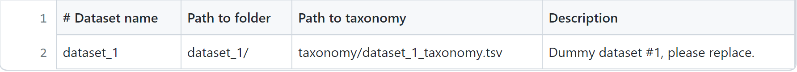
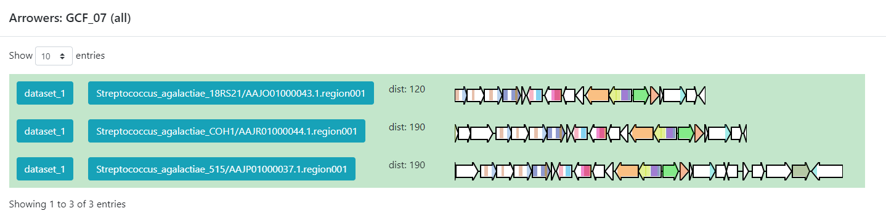
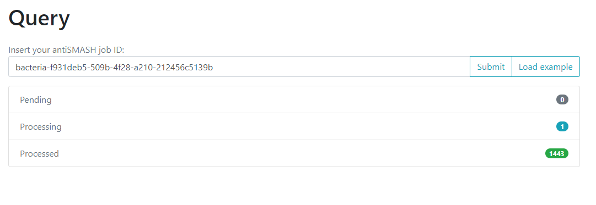

## BiG-SLiCE and BiG-FAM a set of tools to compare the microbial metabolic diversity

Around the curriculum, we have been learning about the metabolic 
capability of bacteria lineages encoded in BGCs. Before we start this 
lesson, let's remember that the products of these clusters are 
biomolecules that are (mostly) not essential for life. They take 
the role of "tools" that offer some ecological and physiological 
advantage to the bacterial lineage producing it. 

The presence/abscence of a set of BGCs in a genome, can be associated 
to the ecological niches and (micro)environments which the linage faces. 

The counterpart of this can be taked as how biosynthetically diverse 
a bacterial lineage can be because of its environment.

To answer some of this questions, we need a way to compare the metabolic 
capabilities of a set of diverse bacterial lineages. One way to do this 
is to compare the state (identity) of homologous BGCs. The homologous 
clusters that share a similar domain arquitecture and in consequnece 
will produce a similar metabolite, are grouped into a bigger group that 
we call **Gene Cluster Families (GCFs)**. 

There are some programs capable of clustering BGCs 
in GCFs, _e.g._[ ClusterFinder](https://github.com/petercim/ClusterFinder) and [DeepBGC](https://github.com/Merck/deepbgc). `BiG-SLICE` is a 
software that has been [designed](https://academic.oup.com/gigascience/article/10/1/giaa154/6092777) to do this work in less time even 
when dealing with large datasets (1.2 million BGCs). This 
characteristic makes it a good tool to compare the metabolic 
diversity of several bacterial lineages.

### The input for BiG-SLiCE

First of all, let's activate the conda environment where `BiG-SLiCE` 
has been installed and all the needed softwares for its usage:

~~~
$ conda activate GenomeMining
~~~
{: .language-bash}

You will have now a `(GenomeMining)` label at the beggining of the 
promt line.

If we seek for help using the `--help` flag of `bigslice`, we can get 
a first glance at the input that we need:

~~~
$ bigslice --help | head -n20
~~~
{: .language-bash}

~~~
usage: bigslice [-i <folder_path>] [--resume] [--complete] [--threshold T]
                [--threshold_pct <N>] [--query <folder_path>]
                [--query_name <name>] [--run_id <id>] [--n_ranks N_RANKS]
                [-t <N>] [--hmmscan_chunk_size <N>] [--subpfam_chunk_size <N>]
                [--extraction_chunk_size EXTRACTION_CHUNK_SIZE] [--scratch]
                [-h] [--program_db_folder PROGRAM_DB_FOLDER] [--version]
                <output_folder_path>

                            _________
 ___    _____|\____|\____|\ \____    \
|   \  |       }     }     }  ___)_ _/__
| >  | _--/--|/----|/----|/__/  __||  __|
|   < | ||  __/ (  (| | \___/  /__/|  _|
| >  || || |_ | _)  ) |_ | |\  \__ | |__
|____/|_| \___/|___/|___||_| \____||____| [ Version 1.1.0 ]

Biosynthetic Gene clusters - Super Linear Clustering Engine
(https://github.com/medema-group/bigslice)

positional arguments:
~~~
{: .output}

`BiG-SLiCE` is asking for a folder as the input. First, it is 
important to highlight that the bones of this folder are the BGCs 
from a group of genomes that has been obtained by `AntiSMASH`. In its [GitHub](https://github.com/medema-group/bigslice) page, we can search for 
an input folder [template](https://github.com/medema-group/bigslice/tree/master/misc/input_folder_template). The folder needs three 
main components:

- **datasets.tsv:** This is a file that **needs to have this exact name**. This must be a tabular separated file where the information of 
each dataset (BGCs from a group of genomes) must be specified.

- **dataset_n:** Each dataset will be composed by the BGCs of different 
genomes. We can give `BiG-SLiCE` **n** groups of BGCs. The separation 
of the BGCs in different datasets is due to the different 
characteristics that the bacterial lineages can have. For example, if 
we have a set of bacterial populations that came from maize roots and 
other ones that were obtained from tomato roots, we can put them into 
dataset_1 and dataset_2 respectively.

- **taxonomy_n.tsv:**This is also a tabular separated file that will 
carry the taxonomix information of each of the genomes where the 
input BGCs were found and the path to reach these BGCs inside the 
input-folder:
  1. Genome folder name (ends with '/')
  2. Kingdom / Domain name
  3. Class name
  4. Order name
  5. Family name
  6. Genus name
  7. Species name
  8. Organism / Strain name

Here, we have an example of the structure of the `input-folder`:

### Creating the input-folder

First, we will create a `bigslice` folder inside the 
`results` directory. 

 ~~~
$ cd ~/dc_workshop/results
$ mkdir bigslice
$ bigslice
~~~
{: .language-bash}

Now that we now what input `BiG-SLiCE` requires, we will do our 
input-folder step by step. First, let's remeber how much genomes 
we have:

~~~
$ ls -F ../antismash/output/
~~~
{: .language-bash}

~~~
Streptococcus_agalactiae_18RS21/  Streptococcus_agalactiae_A909/    Streptococcus_agalactiae_COH1/
Streptococcus_agalactiae_515/     Streptococcus_agalactiae_CJB111/  Streptococcus_agalactiae_H36B/
Streptococcus_thermophilus_LMD-9/  Streptococcus_thermophilus_LMG_18311/
~~~
{: .output}

We have six _Streptococcus_ genomes from the original papar, and two  
public genomes. We will allocate their respective BGC `.gbk`s in 
two `dataset`s, one for the genomes from Tettelin _et al._ paper, and 
the another for the public ones.

~~~
$ mkdir input-folder
$ mkdir input-folder/dataset_1
$ mkdir input-folder/dataset_2
$ mkdir input-folder/taxonomy
$ tree
~~~
{: .language-bash}

~~~
.
└── input-folder
    ├── dataset_1
    ├── dataset_2
    └── taxonomy

4 directories, 0 files
~~~
{: .output}

Now we will create the folders for the BGCs of the dataset_1 genomes. 
We will take advantage on the strain name of our _Streptococcus agalactiae_ lineajes to create their folders:

~~~
$ for i in 18RS21 COH1 515 H36B A909 CJB111; 
  do mkdir input-folder/dataset_1/Streptococcus_agalactiae_$i;
  done
$ tree -F
~~~
{: .language-bash}

~~~
.
└── input-folder/
    ├── dataset_1/
    │   ├── Streptococcus_agalactiae_18RS21/
    │   ├── Streptococcus_agalactiae_515/
    │   ├── Streptococcus_agalactiae_A909/
    │   ├── Streptococcus_agalactiae_CJB111/
    │   ├── Streptococcus_agalactiae_COH1/
    │   └── Streptococcus_agalactiae_H36B/
    ├── dataset_2/
    └── taxonomy/

10 directories, 0 files
~~~
{: .output}

We will do the same for the public genomes:
~~~
$ for i in LMD-9 LMG_18311; 
  do mkdir input-folder/dataset_2/Streptococcus_thermophilus_$i;
  done
$ tree -F
~~~
{: .language-bash}

~~~
.
└── input-folder/
    ├── dataset_1/
    │   ├── Streptococcus_agalactiae_18RS21/
    │   ├── Streptococcus_agalactiae_515/
    │   ├── Streptococcus_agalactiae_A909/
    │   ├── Streptococcus_agalactiae_CJB111/
    │   ├── Streptococcus_agalactiae_COH1/
    │   └── Streptococcus_agalactiae_H36B/
    ├── dataset_2/
    │   ├── Streptococcus_thermophilus_LMD-9/
    │   └── Streptococcus_thermophilus_LMG_18311/
    └── taxonomy/

12 directories, 0 files
~~~
{: .language-bash}

Next, we will copy the BGCs `.gbk` files from the dataset_1 
genomes from each `AntiSMASH` output directory to its respective 
folder .

~~~
$ ls input-folder/dataset_1/ | while read line;
  do cp ../antismash/output/$line/*region*.gbk input-folder/dataset_1/$line; 
  done
$ tree -F
~~~
{: .language-bash}

~~~
.
└── input-folder/
    ├── dataset_1/
    │   ├── Streptococcus_agalactiae_18RS21/
    │   │   ├── AAJO01000016.1.region001.gbk
    │   │   ├── AAJO01000043.1.region001.gbk
    │   │   └── AAJO01000226.1.region001.gbk
    │   ├── Streptococcus_agalactiae_515/
    │   │   ├── AAJP01000027.1.region001.gbk
    │   │   └── AAJP01000037.1.region001.gbk
    │   ├── Streptococcus_agalactiae_A909/
    │   │   ├── CP000114.1.region001.gbk
    │   │   └── CP000114.1.region002.gbk
    │   ├── Streptococcus_agalactiae_CJB111/
    │   │   ├── AAJQ01000010.1.region001.gbk
    │   │   └── AAJQ01000025.1.region001.gbk
    │   ├── Streptococcus_agalactiae_COH1/
    │   │   ├── AAJR01000002.1.region001.gbk
    │   │   └── AAJR01000044.1.region001.gbk
    │   └── Streptococcus_agalactiae_H36B/
    │       ├── AAJS01000020.1.region001.gbk
    │       └── AAJS01000117.1.region001.gbk
    ├── dataset_2/
    │   ├── Streptococcus_thermophilus_LMD-9/
    │   └── Streptococcus_thermophilus_LMG_18311/
    └── taxonomy/

12 directories, 13 files
~~~
{: .output}

Again, we will do the same for the BGCs `.gbk`s of the dataset_2:
~~~
$ ls input-folder/dataset_2/ | while read line;
  do cp ../antismash/output/$line/*region*.gbk input-folder/dataset_2/$line; 
  done
$ tree -F
~~~
{: .language-bash}

~~~
.
└── input-folder/
    ├── dataset_1/
    │   ├── Streptococcus_agalactiae_18RS21/
    │   │   ├── AAJO01000016.1.region001.gbk
    │   │   ├── AAJO01000043.1.region001.gbk
    │   │   └── AAJO01000226.1.region001.gbk
    │   ├── Streptococcus_agalactiae_515/
    │   │   ├── AAJP01000027.1.region001.gbk
    │   │   └── AAJP01000037.1.region001.gbk
    │   ├── Streptococcus_agalactiae_A909/
    │   │   ├── CP000114.1.region001.gbk
    │   │   └── CP000114.1.region002.gbk
    │   ├── Streptococcus_agalactiae_CJB111/
    │   │   ├── AAJQ01000010.1.region001.gbk
    │   │   └── AAJQ01000025.1.region001.gbk
    │   ├── Streptococcus_agalactiae_COH1/
    │   │   ├── AAJR01000002.1.region001.gbk
    │   │   └── AAJR01000044.1.region001.gbk
    │   └── Streptococcus_agalactiae_H36B/
    │       ├── AAJS01000020.1.region001.gbk
    │       └── AAJS01000117.1.region001.gbk
    ├── dataset_2/
    │   ├── Streptococcus_thermophilus_LMD-9/
    │   │   ├── CP000419.1.region001.gbk
    │   │   ├── CP000419.1.region002.gbk
    │   │   ├── CP000419.1.region003.gbk
    │   │   ├── CP000419.1.region004.gbk
    │   │   └── CP000419.1.region005.gbk
    │   └── Streptococcus_thermophilus_LMG_18311/
    │       ├── NC_006448.1.region001.gbk
    │       ├── NC_006448.1.region002.gbk
    │       ├── NC_006448.1.region003.gbk
    │       ├── NC_006448.1.region004.gbk
    │       ├── NC_006448.1.region005.gbk
    │       └── NC_006448.1.region006.gbk
    └── taxonomy/

12 directories, 24 files
~~~
{: .language-bash}

> ## Exercise 1.
> As we have seen, the structure of the input folder for BiG-SLiCE is quite difficult to get. Imagine "Sekiro" wants to copy the directory structure to use it for future BiG-SLiCE inputs.
> Consider the following directory structure:
> ~~~
>    └── input_folder/                    
>        ├── datasets.tsv           
>        ├── dataset_1/
>        |   ├── genome_1A/
>        |   |   ├── genome_1A.region001.gbk
>        |   |   └── genome_1A.region002.gbk
>        |   ├── genome_1B/
>        |   |   ├── genome_1B.region001.gbk
>        |   |   └── genome_1B.region002.gbk
>        ├── dataset_2/
>        |   ├── genome_2A/
>        |   |   ├── genome_2A.region001.gbk
>        |   |   └── genome_2A.region002.gbk
>        |   ├── genome_2B/
>        |   |   ├── genome_2B.region001.gbk
>        |   |   └── genome_2B.region002.gbk
>        └── taxonomy/
>            ├── taxonomy_dataset_1.tsv
>            └── taxonomy_dataset_2.tsv                     
> ~~~
> {: .output}
> Which would be the commands to copy the directory structure without the files (just the folders)?  
> a)
> ~~~
> $ cp -r input_folder input_folder_copy
> $ cd input_foder_copy
> $ rm -r
> ~~~
> {: .language-bash}
> b)
> ~~~
> $ mv -r input_folder input_folder_copy
> $ rm input_folder_copy/dataset_1/genome_1A/* input_folder_copy/dataset_1/genome_1B/*
> $ rm input_folder_copy/dataset_2/genome_2A/* input_folder_copy/dataset_2/genome_2B/*
> $ rm input_folder_copy/taxonomy/*
> ~~~
> {: .language-bash}
> c)
> ~~~
> $ cp -r input_folder input_folder_copy
> $ rm input_folder_copy/dataset_1/genome_1A/* input_folder_copy/dataset_1/genome_1B/*
> $ rm input_folder_copy/dataset_2/genome_2A/* input_folder_copy/dataset_2/genome_2B/*
> $ rm input_folder_copy/taxonomy/*
> ~~~
> {: .language-bash}
> d)
> ~~~
> $ cp -r input_folder input_folder_copy
> $ rm input_folder_copy/dataset_1/genome_1A/* /genome_1B/*
> $ rm input_folder_copy/dataset_2/genome_2A/* /genome_2B/*
> $ rm input_folder_copy/taxonomy/*
> ~~~
> {: .language-bash}
> > ## Solution
> > First we need to copy the whole directory to make an input_folder_copy. After that we want to erase the files inside the directories dataset_1/genome_1A, dataset_1/genome_1B, dataset_2/genome_2A, dataset2/genome_2B and taxonomy/  
> > c)
> > ~~~
> > $ cp -r input_folder input_folder_copy
> > $ rm input_folder_copy/dataset_1/genome_1A/* input_folder_copy/dataset_1/genome_1B/*
> > $ rm input_folder_copy/dataset_2/genome_2A/* input_folder_copy/dataset_2/genome_2B/*
> > $ rm input_folder_copy/taxonomy/*
> > ~~~
> > {: .language-bash}
> {: .solution}
{: .challenge}

**datasets.tsv file - The [silmaril](https://lotr.fandom.com/wiki/Silmarils) of  iG-SLiCE**

The next step is to create the main file **datasets.tsv**. First we 
put the first lines to this file. In each of these `.tsv` files, we 
can put lines that begin with `#`. This will not be read it by the 
code, and it can be of help to know which information is located 
in those files. We will use the command `echo` with the `-e` flag 
that will enable us to put tab separations between the text:

~~~
$ cd input-folder
$ echo -e "#Dataset name""\t""Path to folder""\t""Path to taxonomy""\t""Description" > datasets.tsv
$ more datasets.tsv

~~~
{: .language-bash}

~~~
#Dataset name   Path to folder  Path to taxonomy        Description
~~~
{: .output}

We will use `echo` *One more time* to put the information of our two 
datasets. But this time, we will indicate bash that we want to insert 
this new line in the existing `datasets.tsv` with the `>>` option.

~~~
$ echo -e "dataset_1""\t""dataset_1/""\t""taxonomy/dataset_1_taxonomy.tsv""\t""Tetteling genomes" >> datasets.tsv
$ echo -e "dataset_2""\t""dataset_2/""\t""taxonomy/dataset_2_taxonomy.tsv""\t""Public genomes" >> datasets.tsv
$ more datasets.tsv
~~~
{: .language-bash}

~~~
#Dataset name   Path to folder  Path to taxonomy        Description
dataset_1       dataset_1/      taxonomy/dataset_1_taxonomy.tsv Tetteling genomes
dataset_2       dataset_2/      taxonomy/dataset_2_taxonomy.tsv Public genomes
~~~
{: .output}

The main file of the input-folder is finished!

#### The taxonomy of the input-folder

We also need to specify the taxonomic assignation of each of the 
intup genomes BGC's. We will build one `dataset_taxonomy.tsv` file 
for each one of our datasets, _i.e._ two in total. First, let's create 
the header of each one of these files using `echo`:

~~~
$ echo -e "#Genome folder""\t"Kingdom"\t"Phylum"\t"Class"\t"Order"\t"Family"\t"Genus"\t""Species Organism" > taxonomy/dataset_1_taxonomy.tsv
$ echo -e "#Genome folder""\t"Kingdom"\t"Phylum"\t"Class"\t"Order"\t"Family"\t"Genus"\t""Species Organism" > taxonomy/dataset_2_taxonomy.tsv

$ more taxonomy/dataset_1_taxonomy.tsv
~~~
{: .language-bash}

~~~
#Genome folder  Kingdom Phylum  Class   Order   Family  Genus   Species Organism
~~~
{: .output}

There are several ways to obtain the taxonomic data. One of them is 
searching for each lineage taxonomic identification on [NCBI](https://www.ncbi.nlm.nih.gov/guide/taxonomy/). There is also a way to get this information from our `.gbk` files:

~~~
$ head -n20 ../../annotated/Streptococcus_agalactiae_18RS21.gbk
~~~
{: .language-bash}

~~~
LOCUS       AAJO01000169.1          2501 bp    DNA     linear   UNK
DEFINITION  Streptococcus agalactiae 18RS21
ACCESSION   AAJO01000169.1
KEYWORDS    .
SOURCE      Streptococcus agalactiae 18RS21.
  ORGANISM  Streptococcus agalactiae 18RS21
            Bacteria; Terrabacteria group; Firmicutes; Bacilli;
            Lactobacillales; Streptococcaceae; Streptococcus; Streptococcus
            agalactiae.
FEATURES             Location/Qualifiers
     source          1..2501
                     /mol_type="genomic DNA"
                     /db_xref="taxon:342613"
                     /genome_md5=""
                     /project="nselem35_342613"
                     /genome_id="342613.37"
                     /organism="Streptococcus agalactiae 18RS21"
     CDS             1..213
                     /db_xref="SEED:fig|342613.37.peg.1973"
                     /db_xref="GO:0003735"
~~~
{: .output}

We will use again `echo` to write this information into our 
`dataset_taxonomy.tsv`. This is going to be a little long because 
we have 8 genomes and we will need to write 8 `echo` lines, but 
bear with us. We are almost there!

~~~
$ echo -e "Streptococcus_agalactiae_18RS21/""\t"Bacteria"\t"Firmicutes"\t"Bacilli"\t"Lactobacillales"\t"Streptococcaceae"\t"Streptococcus"\t""Streptococcus agalactiae 18RS21" >> taxonomy/dataset_1_taxonomy.tsv

$ echo -e "Streptococcus_agalactiae_515/""\t"Bacteria"\t"Firmicutes"\t"Bacilli"\t"Lactobacillales"\t"Streptococcaceae"\t"Streptococcus"\t""Streptococcus agalactiae 515" >> taxonomy/dataset_1_taxonomy.tsv

$ echo -e "Streptococcus_agalactiae_A909/""\t"Bacteria"\t"Firmicutes"\t"Bacilli"\t"Lactobacillales"\t"Streptococcaceae"\t"Streptococcus"\t""Streptococcus agalactiae A909" >> taxonomy/dataset_1_taxonomy.tsv

$ echo -e "Streptococcus_agalactiae_CJB111/""\t"Bacteria"\t"Firmicutes"\t"Bacilli"\t"Lactobacillales"\t"Streptococcaceae"\t"Streptococcus"\t""Streptococcus agalactiae CJB111" >> taxonomy/dataset_1_taxonomy.tsv

$ echo -e "Streptococcus_agalactiae_COH1/""\t"Bacteria"\t"Firmicutes"\t"Bacilli"\t"Lactobacillales"\t"Streptococcaceae"\t"Streptococcus"\t""Streptococcus agalactiae COH1" >> taxonomy/dataset_1_taxonomy.tsv

$ echo -e "Streptococcus_agalactiae_H36B/""\t"Bacteria"\t"Firmicutes"\t"Bacilli"\t"Lactobacillales"\t"Streptococcaceae"\t"Streptococcus"\t""Streptococcus agalactiae H36B" >> taxonomy/dataset_1_taxonomy.tsv

$ more taxonomy/dataset_1_taxonomy.tsv
~~~
{: .language-bash}
~~~
#Genome folder   Kingdom Phylum  Class   Order   Family  Genus   Species Organism
Streptococcus_agalactiae_18RS21/        Bacteria        Firmicutes      Bacilli Lactobacillales Strept
ococcaceae      Streptococcus   Streptococcus agalactiae 18RS21
Streptococcus_agalactiae_515/   Bacteria        Firmicutes      Bacilli Lactobacillales Streptococcace
ae      Streptococcus   Streptococcus agalactiae 515
Streptococcus_agalactiae_A909/  Bacteria        Firmicutes      Bacilli Lactobacillales Streptococcace
ae      Streptococcus   Streptococcus agalactiae A909
Streptococcus_agalactiae_CJB111/        Bacteria        Firmicutes      Bacilli Lactobacillales Strept
ococcaceae      Streptococcus   Streptococcus agalactiae CJB111
Streptococcus_agalactiae_COH1/  Bacteria        Firmicutes      Bacilli Lactobacillales Streptococcace
ae      Streptococcus   Streptococcus agalactiae COH1
Streptococcus_agalactiae_H36B/  Bacteria        Firmicutes      Bacilli Lactobacillales Streptococcace
ae      Streptococcus   Streptococcus agalactiae H36B
~~~
{: .output}

We will do the same for the `dataset_2_taxonomy.tsv` file:

~~~
$ echo -e "Streptococcus_thermophilus_LMD-9/""\t"Bacteria"\t"Firmicutes"\t"Bacilli"\t"Lactobacillales"\t"Streptococcaceae"\t"Streptococcus"\t""Streptococcus thermophilus LMD-9" >> taxonomy/dataset_2_taxonomy.tsv

$ echo -e "Streptococcus_thermophilus_LMG_18311/""\t"Bacteria"\t"Firmicutes"\t"Bacilli"\t"Lactobacillales"\t"Streptococcaceae"\t"Streptococcus"\t""Streptococcus thermophilus LMG 18311" >> taxonomy/dataset_2_taxonomy.tsv

$ more taxonomy/dataset_2_taxonomy.tsv
~~~
{: .language-bash}
~~~
#Genome folder   Kingdom Phylum  Class   Order   Family  Genus   Species Organism
Streptococcus_thermophilus_LMD-9/       Bacteria        Firmicutes      Bacilli Lactobacillales Strept
ococcaceae      Streptococcus   Streptococcus thermophilus LMD-9
Streptococcus_thermophilus_LMG_18311/   Bacteria        Firmicutes      Bacilli Lactobacillales Strept
ococcaceae      Streptococcus   Streptococcus thermophilus LMG 18311
~~~
{: .output}

Now, we have the organization of our `input-folder` complete
~~~
$ cd ..
$ tree -F input-folder/
~~~
{: .language-bash}

~~~
input-folder/
├── dataset_1/
│   ├── Streptococcus_agalactiae_18RS21/
│   │   ├── AAJO01000016.1.region001.gbk
│   │   ├── AAJO01000043.1.region001.gbk
│   │   └── AAJO01000226.1.region001.gbk
│   ├── Streptococcus_agalactiae_515/
│   │   ├── AAJP01000027.1.region001.gbk
│   │   └── AAJP01000037.1.region001.gbk
│   ├── Streptococcus_agalactiae_A909/
│   │   ├── CP000114.1.region001.gbk
│   │   └── CP000114.1.region002.gbk
│   ├── Streptococcus_agalactiae_CJB111/
│   │   ├── AAJQ01000010.1.region001.gbk
│   │   └── AAJQ01000025.1.region001.gbk
│   ├── Streptococcus_agalactiae_COH1/
│   │   ├── AAJR01000002.1.region001.gbk
│   │   └── AAJR01000044.1.region001.gbk
│   └── Streptococcus_agalactiae_H36B/
│       ├── AAJS01000020.1.region001.gbk
│       └── AAJS01000117.1.region001.gbk
├── dataset_2/
│   ├── Streptococcus_thermophilus_LMD-9/
│   │   ├── CP000419.1.region001.gbk
│   │   ├── CP000419.1.region002.gbk
│   │   ├── CP000419.1.region003.gbk
│   │   ├── CP000419.1.region004.gbk
│   │   └── CP000419.1.region005.gbk
│   └── Streptococcus_thermophilus_LMG_18311/
│       ├── NC_006448.1.region001.gbk
│       ├── NC_006448.1.region002.gbk
│       ├── NC_006448.1.region003.gbk
│       ├── NC_006448.1.region004.gbk
│       ├── NC_006448.1.region005.gbk
│       └── NC_006448.1.region006.gbk
├── datasets.tsv
└── taxonomy/
    ├── dataset_1_taxonomy.tsv
    └── dataset_2_taxonomy.tsv

11 directories, 27 files
~~~
{: .output}

> ## Exercise 2 
> If you use the head -n20 on one of your .gbk files, you will obtain an output like this
>~~~
>LOCUS       AAJO01000169.1          2501 bp    DNA     linear   UNK
>DEFINITION  Streptococcus agalactiae 18RS21
>ACCESSION   AAJO01000169.1
>KEYWORDS    .
>SOURCE      Streptococcus agalactiae 18RS21.
>  ORGANISM  Streptococcus agalactiae 18RS21
>            Bacteria; Terrabacteria group; Firmicutes; Bacilli;
>            Lactobacillales; Streptococcaceae; Streptococcus; Streptococcus
>            agalactiae.
>FEATURES             Location/Qualifiers
>     source          1..2501
>                     /mol_type="genomic DNA"
>                     /db_xref="taxon:342613"
>                     /genome_md5=""
>                     /project="nselem35_342613"
>                     /genome_id="342613.37"
>                     /organism="Streptococcus agalactiae 18RS21"
>     CDS             1..213
>                     /db_xref="SEED:fig|342613.37.peg.1973"
>                     /db_xref="GO:0003735"
>~~~
>{: .output}
> As you can see, in the gbk file we can find the taxonomic information that we need to fill the taxonomic information of each genome.
> Fill in the blank spaces to complete the command that would get the organism information from the .gbk file. 
> 
> 
 $ grep ___________ -m1 ____________ Streptococcus_agalactiae_18RS21.gbk 

>  
 -B 3 &nbsp; &nbsp; &nbsp; -A 3 &nbsp; &nbsp; &nbsp; -a  &nbsp; &nbsp; &nbsp; 'Streptococcus' &nbsp; &nbsp; &nbsp; 'ORGANISM' &nbsp; &nbsp; &nbsp; 'gbk'

> To obtain the next result:
> 
> ~~~
>  ORGANISM  Streptococcus agalactiae 18RS21
>            Bacteria; Terrabacteria group; Firmicutes; Bacilli;
>            Lactobacillales; Streptococcaceae; Streptococcus; Streptococcus
>            agalactiae.
> ~~~
> {: .output}  
> >  You can use the `grep --help` command to get information about the available options for the `grep` command
>{: .keypoints} 
>
> > ## Solution
> > We need to use the grep command to search for the word "ORGANISM" in the file. Once located we just want to get the first instance of the word that is why we use the -m1 flag. Then we want the 3 next lines of the file after the instance, because that's where the information is. So the final command would be:
> > ~~~
> > $ grep 'ORGANISM' -m1 -A3 Streptococcus_agalactiae_18RS21.gbk
> > ~~~
> > {: .language-bash}
> {: .solution}
{: .challenge}

### Running BiG-SLiCE

We are ready to run `BiG-SLICE`. After we type the next line 
of commmand, it will take close to 3 minutes long to end the 
process:

~~~
$ bigslice -i input-folder output-bigslice
~~~
{: .language-bash}

~~~
...
...
BiG-SLiCE run complete!
~~~
{: .output}

In order to see the results, we need to download the 
`output-bigslice` to out local computer. We will use 
the `scp` command to accomplish this. 

Let's open another terminal and **without connecting it to 
the remote computer** (_i.e._ in your own computer), move to 
a directory where you know you can save the folder. In this 
example we will copy it to the `Documents` folder of our 
computer.

~~~
$ cd Documents/
$ scp -r virtual-computerbetterlab@###.###.###.##/home/virtual-User/dc_workshop/results/bigslice/output-bigslice .
$ ls -F
~~~
{: .language-bash}

~~~
output-bigslice/
~~~
{: .output}

The `BiG-SLiCE` prepared the code so that in each output 
folder we will obtain the output files and some scripts that 
will generate a way to visualize the data. 

~~~
$ ls output-bigslice/
~~~
{: .language-bash}

~~~
app  LICENSE.txt  requirements.txt  result  start_server.sh
~~~
{: .output}

The file `requirements.txt` contains the names of two 
softwares that need to be installed to use the visualization: 
`SQLite3` and `flask`. We will install these with the next 
command:

~~~
$ pip install -r output-bigslice/requirements.txt
~~~
{: .language-bash}

~~~
...
...
Successfully installed pysqlite3
~~~
{: .output}

After the installation, we can use the `start_server.sh` to 
generate a 

~~~
$ bash output-bigslice/start_server.sh
~~~
{: .language-bash}

~~~
 * Serving Flask app "/mnt/d/documentos/sideprojects/sc-mineria/bigSlice/output-bigslice/app/run.py"
 * Environment: production
   WARNING: This is a development server. Do not use it in a production deployment.
   Use a production WSGI server instead.
 * Debug mode: off
 * Running on http://0.0.0.0:5000/ (Press CTRL+C to quit)
~~~
{: .output}

The result looks a little intimidating, but if you obtained 
a result that looks like the above one do not worry. Next, we 
need to open an internet browser. In a new tab let's type 
the next line.

~~~
http://localhost:5000/
~~~
{: .url}

As a result, we will obtain a web-page that looks like this:

Here we have a summary of the result that we obtained. In the left part, we see a 
set of 7 fields. 3 of them have the information that we generated: `Summary`, 
`Datasets`, and `Runs`. The other ones are for information regarding the 
software, one of them is to give feedback to the developers. You can acces to the 
`Datasets` and `Runs` page also from the options that we see in the main part of 
this summary page. The first part of this summary describes the datasets that 
we provided as input. The second one is the information of the process (when we 
ran the program) that `BiG-SLiCE` carry out with our data. 

If we click into the `Runs` field on the left or the `run-0001` blue button on the 
**Runs** main section, we will jumpo to the page that give us the information 
regarding the BGCs GCFs that were obtained:

In this new page we have two bar-plots that give us information regarding if the BGCs that 
we sumministrated were classified as fragmented or complete by `AntiSMASH` 
(according to the `AntiSMASH` algorithm, a BGC can be classified as fragmented 
if it is found at the edge of a contig), and how many families were obtained 
with singletons (composed of just one BGC) and of 2-3 BGCs.

If we go to the bottom of this page, we will found a table of all the GCFs with 
information of the number of BGCs that compose them, the representative BGC class 
inside each family, and which genus has more BGCs that belong to each family.

Let's click on the `+` symbol of the GCF_7, and then on the `View` button that 
is displayed. This will take us to a page with stadistics of the BGCs that 
are part of this family. 

Inside this section, we can found a great amount of information regarding the GCF_7 
BGC's. If we jump to section called `Members`, we can click on the 
`view BGC arrowers` button to get a visualization of the domains that are 
part of each of the genes of these BGCs.

As we can see, this tool can be used to clusterize homologous BGCs that share 
a structure. With this knowledge, we can try some hypothesis or even 
build new ones in the light of this information.

> ## Discussion
> Considering the results in the runs tab, we can see that there are a lot of Gene Cluster Families that have only one cluster associated to it (GCF_1, GCF_2, GCF_4, GCF_5, GCF_6, GCF_8, GCF_9, GCF_13, and GCF_15).  
> What does this tell us about the metabolites diversity of the Streptococcus sample?
> > ## Solution
> > We can see that there are some unique gene cluster families, which mean that there are some organism that has that unique gene cluster and therefore he has some metabolite that the others don´t and that may help him in his environmente. So, as there are many singleton Gene Cluster Families, we can say that theres a big diversity from the sample because many of the organisms in the sample have unique "habilities" (metabolites).
> {: .solution}
{: .discussion}   

> ## Discussion
> Suppose we get the following results from a sample of 6 organisms.
>  
> |-------------------+--------------------------------------------------------|
> |        GCF        |                     #core members                      |
> |:-----------------:+:------------------------------------------------------:|
> |       GCF_1       |                            6                           |
> |-------------------+--------------------------------------------------------|
> |       GCF_2       |                            5                           |
> |-------------------+--------------------------------------------------------|
> |       GCF_3       |                            5                           |
> |-------------------+--------------------------------------------------------|
> |       GCF_4       |                            6                           |
> |-------------------+--------------------------------------------------------|
> 
>  What can we infer about the metabolite diversity?
>  
> > ## Solution
> > As most of the organism have a gene cluster in the gene cluster family, we can infer that most of them have the same secondary metabolites which means that theres few metabolite diversity between them.
> {: .solution}
{: .discussion}   

## BiG-FAM 

To demonstrate the funtionality of `BiG-SLICE`, the authors recopilated close to 
1.2 million of BGCs. All this information, they put it on a great database that they 
call `BiG-FAM`. When you get to the main [page](https://bigfam.bioinformatics.nl/home), 
you will face a structure that looks like the one othat we saw on the `BiG-SLICE` result:

One of the options of the left is `Query`. If we click here, we will move to a new 
page were we can insert an `antiSMASH job ID`. This will run a comparison of all 
the BGCs found on that antiSMASH run on a single genome, agains the inmense database. 

We will use the `antiSMASH job ID` from the analysis made on 
_Streptococcus agalactiae_ A909. The `antiSMASH job ID` can be found 
in the `URL` direction of this page in the next format:
taxon-aaaaaaa-bbbb-cccc-dddd-eeeeeeeeeeee.

We will use the job ID that we obtained:

bacteria-f931deb5-509b-4f28-a210-212456c5139b

And click the `submit` option.

This will generate a result page that will indicate with which BGCs from the 
database, the BGCs from out genome is related.


