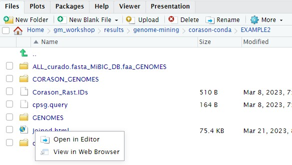
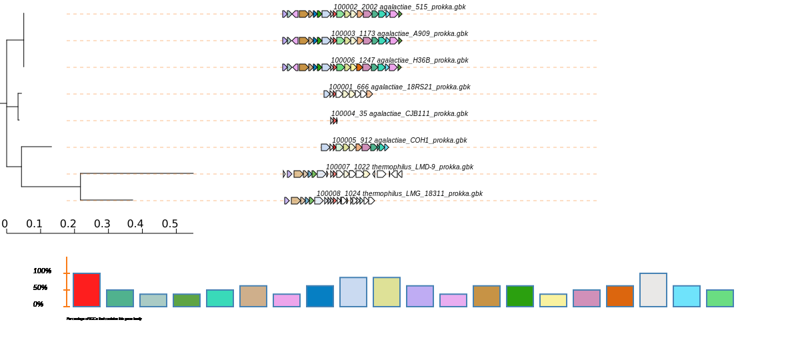

CORASON is a visual tool that identifies gene clusters that share a 
common genomic core and reconstructs multi-locus phylogenies of these 
gene clusters to explore their evolutionary relationships. CORASON 
was developed to find and prioritize biosynthetic gene clusters 
(BGC), but can be used for any kind of clusters.

Input: query gene, reference BGC and genome database.
Output: SVG figure with BGC in the family sorted according 
to the multi-locus phylogeny of the core genes.

Advantages  
- SVG graphs Scalable graphs that allow metadata easy display.  
- Interactive, CORASON is not a static database, it allows to explore your own genomes.  
- Reproducibility, since CORASON runs on docker and conda, 
the containerization allows to always perform the same analysis 
even if you change your Linux/perl/blast/muscle/Gblocks/quicktree local distributions.  

## CORASON conda 
Here we are testing the new stand-alone 
[corason in a conda environment](https://github.com/miguel-mx/corason-conda)
with gbk as input-files. Firstly, activate the corason-conda environment.    

~~~
$ conda deactivate 
$ conda activate /miniconda3/envs/corason  
~~~
{: .language-bash}

~~~
(corason) user@server:~$
~~~
{: .output}

With the environment activated, all CORASON-dependencies are ready to be used. 
The next step is to clone CORASON-software from its GitHub repository. Firstly,
place yourself at the results directory and then clone CORASON-code.
~~~
$ mkdir -p ~/pan_workshop/results/genome-mining 
$ cd ~/pan_workshop/results/genome-mining
$ git clone https://github.com/miguel-mx/corason-conda.git 
$ ls
~~~
{: .language-bash}

The GitHub CORASON repository must be now in your directory. 
~~~
corason-conda 
~~~
{: .output}

Change directory by descending to EXAMPLE2. The file `cpsg.query`, 
contains the reference protein cpsG, whose encoding gene 
is part of the 
[polysaccharide BGC](https://mibig.secondarymetabolites.org/repository/BGC0000744/index.html#r1c1) 
produced by some _S. agalactiae_   

~~~
$ cd corason-conda/EXAMPLE2        
$ ls  
~~~
{: .language-bash}

~~~
cpsg.query  
~~~
{: .output}

As genomic database we will use the prokka-annotated `gbk` files of _S. agalactiae_.
This database will be stored in the reserved directory `CORASON_GENOMES`.  
~~~
$ mkdir  CORASON_GENOMES  
$ cp ~/pan_workshop/results/annotated/*gbk CORASON_GENOMES  
~~~
{: .language-bash}

CORASON was written to be used with RAST annotation as 
input files, in this case we are using a genome database 
composed of `.gbk` files. Thus, we need to convert
gbk files into CORASON-compatible input files.  

~~~
$ ../CORASON/gbkIndex.pl CORASON_GENOMES ../CORASON CORASON_GENOMES 
~~~
{: .language-bash}  

~~~
Directory CORASON_GENOMES                                                                                                
../CORASON/gbk_to_fasta.pl CORASON_GENOMES agalactiae_18RS21_prokka.gbk 100001 ../CORASON                                 
../CORASON/gbk_to_fasta.pl CORASON_GENOMES agalactiae_515_prokka.gbk 100002 ../CORASON                                   
../CORASON/gbk_to_fasta.pl CORASON_GENOMES agalactiae_A909_prokka.gbk 100003 ../CORASON                             
../CORASON/gbk_to_fasta.pl CORASON_GENOMES agalactiae_CJB111_prokka.gbk 100004 ../CORASON                         
../CORASON/gbk_to_fasta.pl CORASON_GENOMES agalactiae_COH1_prokka.gbk 100005 ../CORASON                           
../CORASON/gbk_to_fasta.pl CORASON_GENOMES agalactiae_H36B_prokka.gbk 100006 ../CORASON                            
../CORASON/gbk_to_fasta.pl CORASON_GENOMES thermophilus_LMD-9_prokka.gbk 100007 ../CORASON                          
../CORASON/gbk_to_fasta.pl CORASON_GENOMES thermophilus_LMG_18311_prokka.gbk 100008 ../CORASON   
~~~
{: .output}

Now, all converted genome files, aminoacid fasta files (.faa) 
and annotation files (.txt) should be placed in the 'GENOMES directory'
one level up outside output.  
~~~
$ mv output/* . 
$ ls
~~~
{: .language-bash}  

~~~
CORASON_GENOMES  Corason_Rast.IDs  cpsg.query  GENOMES  output 
~~~
{: .output}  

Finally, we have the query enzyme, the IDs file and a genomic database
of _S. agalactiae_ in the same directory. Run CORASON with 
cpsg.query as query with 1000006 as an example of reference BGC.  
~~~
$ ../CORASON/corason.pl -q cpsg.query -s 100006  -rast_ids Corason_Rast.IDs
~~~
{: .language-bash}

~~~
>> 100001_666.input  Cluster1237  Cluster1245  Cluster1253       cpsg.query_BGC.tre            cpsg.query_tree.svg        
>> 100002_2002.input Cluster1238  Cluster1246  Cluster1254       cpsg.query.BLAST              Frequency                  
>> 100003_1173.input Cluster1239  Cluster1247  Cluster1255       cpsg.query.BLAST.pre          GBK                        
>> 100004_35.input   Cluster1240  Cluster1248  Cluster1256       cpsg.query.parser             Joined.svg                 
>> 100005_912.input  Cluster1241  Cluster1249  Cluster1257       cpsg.query.parser.pre         MINI                       
>> 100006_1247.input Cluster1242  Cluster1250  Concatenados.faa  cpsg.query_PrincipalHits.tre  PrincipalHits.muscle       
>> 100007_1022.input Cluster1243  Cluster1251  CORASON           cpsg.query_Report             PrincipalHits.muscle-gb    
>> 100008_1024.input Cluster1244  Cluster1252  cpsg.query        cpsg.query.svg                TempConcatenados.faa 
~~~
{: .output}  

Finally, we have all the genomic vicinities sorted phylogenetically according to 
the genes in the core-cluster. We can either see the output directly on the server or
download the resulting svg file to our local computer. The format svg stands for scalable vector graphics,
we are save it as an html file in order to get the option of open it as html. 
To see it in the server we must first copy the Joined.svg into Joined.html, then, go to 
the EXAMPLE2 directory in the r-studio files panel located at the bottom right. Once
there clik in the Joined.html file and chose the option View in Web Browser. The corason
figure will output in a new tab.

~~~
$ cp output/cpsg.query-output/Joined.svg  Joined.html
~~~
{: .language-bash}

You can also use `scp` in a local terminal to download the resulting svg file to your local computer.
~~~
$ scp (remoto)/corason-conda/EXAMPLE2/output/cpsg.query-output  Downloads/.
~~~
{: .language-bash}

> ## CORASON has several installation and a conda beta versions
> CORASON has one [docker installation](https://github.com/nselem/corason) where you have to go inside the docker container, its input are RAST files. The script [run_corason](https://bigscape-corason.secondarymetabolites.org/index.html) belongs to another installation that accepts gbk as input files. And finally, this is a beta version of CORASON [conda container](https://github.com/miguel-mx/corason-conda).
{: .callout}


