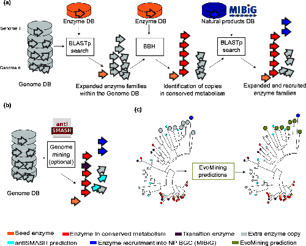
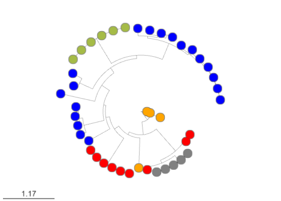
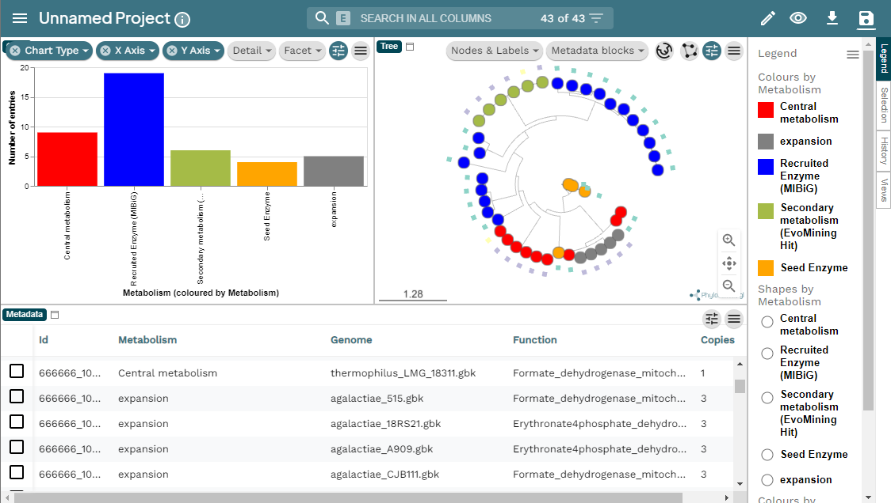



<a href="../fig/evomining.gif">
  
</a>

 Usually, bioinformatics tools related to the prediction of Natural Products (NP) biosynthetic genes try to find metabolic pathways of enzymes that are known to be related with the synthesis of a secondary metabolites. However, these approaches fail for the discovery of novel biosynthetic systems. Thus, [EvoMining](https://www.microbiologyresearch.org/content/journal/mgen/10.1099/mgen.0.000260) try to solve this problem to detect novel enzymes that may be implicated in the synthesis of new natural products in Bacteria.
 
 To know more about EvoMining you can read [Selem et al, Microbial Genomics 2020](https://www.microbiologyresearch.org/content/journal/mgen/10.1099/mgen.0.000260).   
 
This tool looks for protein expansions that may have evolved from the central metabolism into a specialized metabolism. For that, it builds phylogenetic trees based on all the protein copies of a certain enzyme in a given genome database. The output tree will differentiate copies that are related with the central metabolism, copies that are known to be implicated in discovered NP-producing-BGCs i.e. BGCs from [MiBIG database](https://mibig.secondarymetabolites.org/) and, optionally, protein copies that belong to BGCs predicted by [antiSMASH](https://antismash-db.secondarymetabolites.org/). Finally, some branch in the tree will be depicted as "EvoMining hits", which represent enzyme expansions that are evolutionary closer to those copies related with the secondary metabolism (MiBIG or antiSMASH BGCs) than to those related with the central (primary) metabolism.

## Run evomining image

Place yourself at your working directory.
~~~
$ cd   ~/dc_workshop/results/genome-mining/corason-conda/EXAMPLE2  
$ ls
~~~
{: .language-bash}

~~~ 
CORASON_GENOMES  Corason_Rast.IDs  cpsg.query  GENOMES  output 
~~~
{: .output}  

 Run docker container  
~~~
$ docker run --rm -i -t -v $(pwd):/var/www/html/EvoMining/exchange -p 8080:80 nselem/evomining:latest /bin/bash   
~~~
{: .language-bash}  

However, sometimes the port 80 is bussy, on that case you can use other ports like 8080 or 8084:  
```
$ docker run --rm -i -t -v $(pwd):/var/www/html/EvoMining/exchange -p 8080:80 nselem/evomining:latest /bin/bash  
$ docker run --rm -i -t -v $(pwd):/var/www/html/EvoMining/exchange -p 8084:80 nselem/evomining:latest /bin/bash  
```

~~~
# perl startevomining.pl  
~~~
{: .language-bash}


## Set EvoMining databases
~~~
# perl startevomining.pl -g GENOMES -r  Corason_Rast.IDs
~~~
{: .language-bash}  

<a href="../fig/tree.png">
  
</a>

## Getting results
```
scp betterlab@132.248.196.38:~/dc_workshop/results/genome-mining/corason-conda/EXAMPLE2/ALL_curado.fasta_MiBIG_DB.faa_GENOMES/blast/seqf/tree/1.tree ~/Downloads/.
scp betterlab@132.248.196.38:~/dc_workshop/results/genome-mining/corason-conda/EXAMPLE2/ALL_curado.fasta_MiBIG_DB.faa_GENOMES/blast/seqf/tree/1.csv ~/Downloads  
```
  
To explore EvoMining outputs upload 1.nwk and 1.csv 
files to [microReact](https://microreact.org/)  
Here is a [MicroReact visualization](https://microreact.org/project/e8b7wWZkovtavPFFpBXRPp-evomining-streptococcus-example) 
of this EvoMining run.  

<a href="../fig/EvoMiningMicroReact.png">
  
</a>

To run EvoMining with a biggest centralmetabolite DB you can use 
[EvoMining Zenodo](https://zenodo.org/record/1219709#.YqEsFqjMLrc) data.


[ARTS](https://arts.ziemertlab.com/) is another evolutionary 
genome mining software with its corresponding database 
[ARTS-db](https://arts-db.ziemertlab.com/) . 

> ## Callout:Evolutionay Genome Mining
> To know more about Genome Mining you can read these references:
> - The confluence of big data and evolutionary genome mining for the discovery of natural products.
>   [Chevrette et al, 2021](https://doi.org/10.1039/D1NP00013F)`
> - Evolutionary Genome Mining for the Discovery and Engineering of Natural Product Biosynthesis. 
> [Chevrette et al, 2022](https://doi.org/10.1007/978-1-0716-2273-5_8)
{: .callout}
