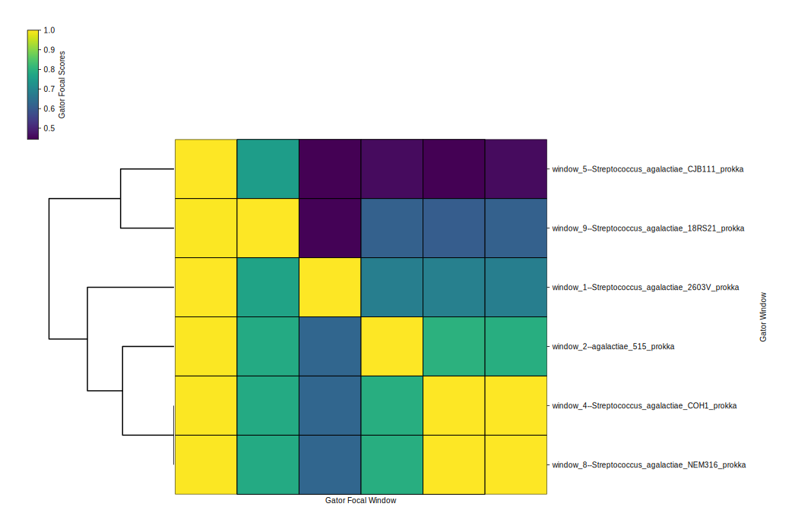
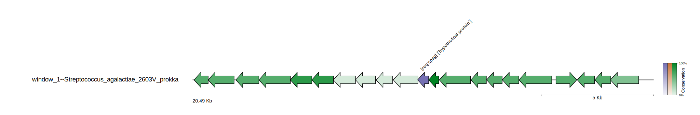
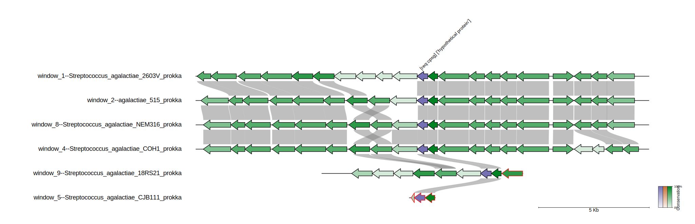



GATOR-GC is a user-friendly algorithm designed for targeted exploration of BGC and genomic islands diversity. It focuses on key biosynthetic enzymes and offers flexibility in defining the taxonomic scope of the analysis. Unlike methods relying on arbitrary cutoffs, GATOR-GC establishes BGC boundaries based on evolutionary principles and implements an enzyme-aware scoring system for assessing BGC-BGC distances, moving beyond a binary presence-absence framework. This approach enhances the tool's capability to identify and prioritize novelty, effectively mapping biosynthetic diversity into distinct groups. 
 
 To know more about GATOR GC you can go to the [Github repository](https://github.com/chevrettelab/gator-gc/).   
 
## Most relevant features

- **Targeted Search**: Conduct targeted searches for essential key enzymes and optional tailor enzymes within Biosynthetic Gene Clusters (BGCs) and genomic islands, streamlining the discovery process.
- **Modular Domain Screening**: Automatically screen user-provided protein files to identify critical modular domains, such as Non-Ribosomal Peptide Synthetases (NRPSs) and Polyketide Synthases (PKSs), using state-of-the-art HMM profiles from antiSMASH for unparalleled precision.
- **Customizable Parameters**: Customize search parameters to include required and optional proteins, ensure complete assembly with all necessary proteins, and define specific distances between required proteins. This customization enhances the specificity of GATOR window identification, offering tailored analysis to meet research needs.
- **Dereplication for Gator Windows**: Remove identical Gator Windows to avoid redundant calculations in subsequent steps, while keeping track of which windows are duplicates
- **GATOR Focal Scores**: Employ a novel enzyme-aware scoring system to accurately compare GATOR windows against targeted focal windows. This approach ensures precise evaluation of genomic contexts and enzyme functionalities.
- **GATOR Conservation**: Generate dynamic gene cluster diagrams that visually differentiate between required and optional proteins using color coding. Transparency levels indicate the gene's presence within GATOR windows, providing a clear visual representation of gene conservation
- **GATOR Neighborhoods**: Visualize each GATOR window's genomic neighborhood with organized tracks based on GATOR focal scores. Homology between genes is intuitively illustrated with gray bars, facilitating easy understanding of genetic relationships and conservation

## GATOR GC

Before starting, make sure to activate the `gator-gc` environment.

~~~
$ conda activate /miniconda3/envs/gator-gc/
~~~
{: .language-bash}

The first part of running GatorGC has to do with creating a database. To facilitate the process first we need to create a directory where we can find all Gator-GC results:

~~~
$ cd   ~/pan_workshop/results/
$ mkdir gator_gc_res/
~~~
{: .language-bash}

After creating this, we will move to this folder
~~~
$ cd   ~/pan_workshop/results/gator_gc_res
~~~
{: .language-bash} 

To create the database, we need all the annotated genomes that we have previously processed. For the database, we only require the genbank files, which end with gbk. We can use the `cp` command to copy all the genbank files of our annotated genomes to a folder in this directory. First, we will create the directory where we will copy the files. 
~~~
$ mkdir   gbks/
~~~
{: .language-bash} 

> ## Exercise 1. Copy all the gbk files to the new directory 
> We know that all the genbank files are in the following path `~/pan_workshop/results/annotated/` and inside the annotated folder, there is a folder for each genome and each folder contains the output files from prokka. You can use `tree ~/pan_workshop/results/annotated/`to confirm this. 
>   Using `cp`, try to complete the gaps in the following command to copy all the genbank files from the previously processed genomes to the new directory you created `gbks`. Remember you can use `*` to match any symbol(s). 
> ~~~
> $ cp  ~/pan_workshop/results/annotated/_________prokka/_________  . 
> ~~~
> >{: .language-bash}
> > ## Solution
> >
> > ~~~
> > cp ~/pan_workshop/results/annotated/*prokka/*gbk .
> > ~~~
> >
> > {: .laguage-bash}
> {: .solution}
{: .challenge} 

## Set GATOR-GC database
Now that we have the genbank files in a folder we can create the necessary database for gator-gc. The command to create the database is `pre-gator-gc`. You can use the `-h` flag to explore the options of this command.

~~~
$ pre-gator-gc -h
~~~
{: .language-bash}   
~~~
usage: pre-gator-gc [-h] -g  [...] [-e] [-t] -o  [-v]

                                                                                                                                                                     
     -\ ---\--\ -------\ ----\ ---\--\ ---\ --\ ----\ ----\--------\ /---                         
   /--/ ---/--/ -------/ ----/ ---/--/ ---/ --/ ----/ ----/--------/ \----\                                                                    
  ________   _____  __________________  __________         _________________                                                                                
 /  _____/  /  _  \ \__    ___/_____  \ \______   \       /  _____/\_   ___ \                                                                     
/   \  ___ /  /_\  \  |    |   /   |   \ |       _/ _____    \  ___/    \  \/                     
\    \_\  \    |    \ |    |  /    |    \|    |   \/_____/    \_\  \     \_____                   
 \______  /____|__  / |____|  \_______  /|____|_  /       \______  /\_______  /                  
        \/        \/                  \/        \/               \/         \/                                                            
    -----\--\ -------\ ----\ ---\--\ ---\ --\ ------\ ----\---------\ /----                                                               
    \----/--/ -------/ ----/ ---/--/ ---/ --/ ------/ ----/---------/ \----/                                                                       

GATOR-GC: Genomic Assessment Tool for Orthologous Regions and Gene Clusters                                                                               
Developer: José D. D. Cediel-Becerra
Afiliation: Microbiology & Cell Science Deparment, University of Florida                                                                              
Please contact José at jcedielbecerra@ufl.edu if you have any issues                                                                                       
Version: v0.9.0

optional arguments:
  -h, --help  show this help message and exit
  -v          Enable verbose output (default: False).

Input Options:
  -g  [ ...]  Directories containing GenBank files (*.gbff/*.gbk/*.gb). You can specify multiple directories separated by spaces. Directories can be specified with or without wildcards.

HMMER Options:
  -e          E-value threshold for HMMER hmmsearch (default: 1e-4).
  -t          Number of CPU threads to use for hmmsearch (default: all available threads).

Output Options:
  -o          Directory where the gator databases (protein,  DIAMOND, and modular domtblout databases) will be saved.
~~~
{: .output}

As we can see in the help output, we have to feed the command with -g which is the path to the folder containing the genbank files and -o which is the directory where we want gator to save the database to be processed (output folder). To create the database we will use the following line of code: 
~~~
$ pre-gator-gc -g gbks/ -o gator_databases -v
~~~
{: .language-bash} 
~~~

                                                                                                                                                                     
     -\ ---\--\ -------\ ----\ ---\--\ ---\ --\ ----\ ----\--------\ /---                         
   /--/ ---/--/ -------/ ----/ ---/--/ ---/ --/ ----/ ----/--------/ \----\                                                                    
  ________   _____  __________________  __________         _________________                                                                                
 /  _____/  /  _  \ \__    ___/_____  \ \______   \       /  _____/\_   ___ \                                                                     
/   \  ___ /  /_\  \  |    |   /   |   \ |       _/ _____    \  ___/    \  \/                     
\    \_\  \    |    \ |    |  /    |    \|    |   \/_____/    \_\  \     \_____                   
 \______  /____|__  / |____|  \_______  /|____|_  /       \______  /\_______  /                  
        \/        \/                  \/        \/               \/         \/                                                            
    -----\--\ -------\ ----\ ---\--\ ---\ --\ ------\ ----\---------\ /----                                                               
    \----/--/ -------/ ----/ ---/--/ ---/ --/ ------/ ----/---------/ \----/                                                                       

GATOR-GC: Genomic Assessment Tool for Orthologous Regions and Gene Clusters                                                                               
Developer: José D. D. Cediel-Becerra
Afiliation: Microbiology & Cell Science Deparment, University of Florida                                                                              
Please contact José at jcedielbecerra@ufl.edu if you have any issues                                                                                       
Version: v0.9.0
[1] - 2024-08-20 14:06:32,797 - INFO - The gator_databases directory was created successfully.
[2] - 2024-08-20 14:06:32,797 - INFO - Total genome files found: 9
[3] - 2024-08-20 14:06:34,223 - INFO - Successfully created the gator protein database to gator_databases/gator_databases.faa
[4] - 2024-08-20 14:06:34,295 - INFO - Successfully created the gator DIAMOND database to gator_databases/gator_databases.dmnd
[5] - 2024-08-20 14:06:34,946 - INFO - Successfully created the gator domtblout database to gator_databases/gator_databases.domtblout
[6] - 2024-08-20 14:06:34,946 - INFO - Execution time: 2.15 seconds
~~~
{: .output}

**QUESTION**: You already read the help page of `pre-gator-gc`. Why we added the flag `-v`?

## GATOR-GC
Now that we have the database ready, let's review what we need to run `gator-gc`. To find out, we can type the command with the `-h` help flag. 

~~~
$  gator-gc -h
~~~
{: .language-bash} 
~~~
usage: gator-gc [-h] -rq  [-op] -g  [...] -d  [-t] [-qc] [-idt] [-e] [-rd] [-we] -o  [-nc] [-nn] [-v]

     -\ ---\--\ -------\ ----\ ---\--\ ---\ --\ ----\ ----\--------\ /--- 
   /--/ ---/--/ -------/ ----/ ---/--/ ---/ --/ ----/ ----/--------/ \----\ 
  ________   _____  __________________  __________         _________________  
 /  _____/  /  _  \ \__    ___/_____  \ \______   \       /  _____/\_   ___ \ 
/   \  ___ /  /_\  \  |    |   /   |   \ |       _/ _____    \  ___/    \  \/ 
\    \_\  \    |    \ |    |  /    |    \|    |   \/_____/    \_\  \     \_____
 \______  /____|__  / |____|  \_______  /|____|_  /       \______  /\_______  /
        \/        \/                  \/        \/               \/         \/ 
    -----\--\ -------\ ----\ ---\--\ ---\ --\ ------\ ----\---------\ /----
    \----/--/ -------/ ----/ ---/--/ ---/ --/ ------/ ----/---------/ \----/

GATOR-GC: Genomic Assessment Tool for Orthologous Regions and Gene Clusters
Developer: José D. D. Cediel-Becerra
Afiliation: Microbiology & Cell Science Deparment, University of Florida
Please contact José at jcedielbecerra@ufl.edu if you have any issues
Version:v0.9.0

optional arguments:
  -h, --help  show this help message and exit
  -v          Enable verbose output. (Default: False)

Input Options:
  -rq         Path to the query protein FASTA file containing required proteins.
  -op         Path to the query protein FASTA file containing optional proteins.
  -g  [ ...]  Directory containing the Genbank files (*.gbff/*.gbk/*.gb).You can specify multiple directories separated by spaces. Directories can be specified with or without wildcards.
  -d          Directory containing the PRE-GATOR-GC databases (.dmnd and .domtblout files). (Required)

Diamond Options:
  -t          Number of CPUs to use for diamond search and hmmsearch. (Default: all available CPUs)
  -qc         Minimum percent query cover for diamond search. (Default: 70)
  -idt        Minimum percent identity for diamond search. (Default: 35)

HMMER Options:
  -e          E-value threshold for hmmsearch. (Default: 1e-4)

GATOR-GC Options:
  -rd         Maximum distance in kilobases between required genes to define a gator window. (Default: 86 kb)
  -we         Extension in kilobases from the start and end positions of the gator windows. (Default: 10 kb)

Output Options:
  -o          Directory to save GATOR-GC results.
  -nc         Disable creation of GATOR conservation figures.
  -nn         Disable creation of GATOR neighborhoods figures.
~~~
{: .output}

From this output, we can see the Gator-GC options. The minimum requirements to run gator-gc are: 
- `-rq` Path to the query protein FASTA file containing required proteins.
- `-g` Directory containing the Genbank files.
- `-d` Directory containing the PRE-GATOR-GC databases.
- `-o` Output directory

To compare the results obtained by the different tools we have used, we will use the reference protein cpsG, whose encoding gene is part of the polysaccharide BGC produced by some *S. agalactiae*. The aminoacid fasta is already in the server in `~/pan_workshop/results/genome-mining/corason-conda/EXAMPLE2/cpsg.query`. So the command to run gator-gc is the following: 

~~~
$  gator-gc -rq ~/pan_workshop/results/genome-mining/corason-conda/EXAMPLE2/cpsg.query -g gbks/ -d gator_databases/ -o cpsg_gator
~~~
{: .language-bash} 

Once Gator-GC finishes, we can observe the structure of the files created by the program using `tree`.

~~~
$  tree cpsg_gator/
~~~
{: .language-bash} 

~~~
cpsg_gator/
├── all_merged_queries_38nh2fip.faa
├── all_merged_queries_unvwb3pq.domtbl
├── allvall_proteins_nuxdlir7.faa
├── concatenated_scores
│   ├── clustermap_gfs.svg
│   └── concatenated_gfs.csv
├── deduplicate_allvall_proteins_e3svhd1_.faa
├── deduplicate_dmnd_db__lno1x3_.dmnd
├── deduplicate_dmnd_out_3ve4lo6v.dmnd
├── deduplication_data
│   ├── deduplication_gfs.csv
│   └── unq_comp.tsv
├── dmnd_db_r0qpquhc.dmnd
├── dmnd_out_aun2m_k5.txt
├── gator_conservation_plots
│   ├── window_1--Streptococcus_agalactiae_2603V_prokka.svg
│   ├── window_2--agalactiae_515_prokka.svg
│   ├── window_4--Streptococcus_agalactiae_COH1_prokka.svg
│   ├── window_5--Streptococcus_agalactiae_CJB111_prokka.svg
│   ├── window_8--Streptococcus_agalactiae_NEM316_prokka.svg
│   └── window_9--Streptococcus_agalactiae_18RS21_prokka.svg
├── gator_neighborhoods_plots
│   ├── window_1--Streptococcus_agalactiae_2603V_prokka_neighborhoods.svg
│   ├── window_2--agalactiae_515_prokka_neighborhoods.svg
│   ├── window_4--Streptococcus_agalactiae_COH1_prokka_neighborhoods.svg
│   ├── window_5--Streptococcus_agalactiae_CJB111_prokka_neighborhoods.svg
│   ├── window_8--Streptococcus_agalactiae_NEM316_prokka_neighborhoods.svg
│   └── window_9--Streptococcus_agalactiae_18RS21_prokka_neighborhoods.svg
├── gator_scores
│   ├── window_1--Streptococcus_agalactiae_2603V_prokka_GFS.csv
│   ├── window_2--agalactiae_515_prokka_GFS.csv
│   ├── window_4--Streptococcus_agalactiae_COH1_prokka_GFS.csv
│   ├── window_5--Streptococcus_agalactiae_CJB111_prokka_GFS.csv
│   ├── window_8--Streptococcus_agalactiae_NEM316_prokka_GFS.csv
│   └── window_9--Streptococcus_agalactiae_18RS21_prokka_GFS.csv
├── non_modular_queries_82tvei7d.faa
├── presence_absence
│   ├── window_1--Streptococcus_agalactiae_2603V_prokka.csv
│   ├── window_2--agalactiae_515_prokka.csv
│   ├── window_4--Streptococcus_agalactiae_COH1_prokka.csv
│   ├── window_5--Streptococcus_agalactiae_CJB111_prokka.csv
│   ├── window_8--Streptococcus_agalactiae_NEM316_prokka.csv
│   └── window_9--Streptococcus_agalactiae_18RS21_prokka.csv
└── windows_genbanks
    ├── gator_hits.tsv
    ├── window_1--Streptococcus_agalactiae_2603V_prokka.gbk
    ├── window_2--agalactiae_515_prokka.gbk
    ├── window_3--Streptococcus_agalactiae_A909_prokka.gbk
    ├── window_4--Streptococcus_agalactiae_COH1_prokka.gbk
    ├── window_5--Streptococcus_agalactiae_CJB111_prokka.gbk
    ├── window_6--Streptococcus_agalactiae_H36B_prokka.gbk
    ├── window_7--Streptococcus_agalactiae_515_prokka.gbk
    ├── window_8--Streptococcus_agalactiae_NEM316_prokka.gbk
    └── window_9--Streptococcus_agalactiae_18RS21_prokka.gbk

7 directories, 47 files
~~~
{: .output}

The output folder `cpsg_gator/` for gator-gc includes the following subfolders:
- **windows_genbanks**: This folder contains GenBank files, each generated for a specific window.
- **presence_absence**: Within this folder, you can find gene-level presence-absence tables for each gator window in CSV format. The tables are named based on the window number and the corresponding GenBank filename. 
- **gator_scores**: This folder houses tables with a structure similar to the presence-absence tables. However, instead of binary numbers, normal distributions were applied to each protein. The highest distribution value is set to 1, and these values were multiplied by the presence-absence values. 
- **concatenated_scores**: This folder contains a CSV file, which consolidates all the gator focal scores. Additionally, a "clustermap_GFSs" file displays the distribution of gator windows based on the gator focal scores using a heatmap and a dendrogram. 

Here is the resulting heatmap and dendrogram. You can view the images in the file explorer on the left side of the server screen. Remember to go to the specific folder to open the file. 

- **gator_conservation_plots**: This folder includes high-quality vectorized figures, each corresponding to a gator focal window. These figures display the gene organization and cluster size. The figure corresponding to the first window is shown below:

In these figures required genes are represented in purple, optional genes in orange, and genes not present in the protein queries files in green. The transparency of each gene's color is determined by the conservation of homologous genes found in the gator windows.

- **gator_neighborhoods_plots**: Here you can find high-quality vectorized figures showcasing genome neighborhoods. Each file corresponds to a gator focal window (top track), with the remaining gator windows sorted based on the gator focal scores. This arrangement positions the second top track as the most similar gator window, and the last track at the bottom represents the most dissimilar gator window. The genomic organization of the gator windows is flipped based on the first required gene in the gator focal window, ensuring that the genomic organization aligns with that of the gator focal window. Homology rails are displayed, depicting the diamond protein alignment position hits in the genes. The first one shoul look like this:

