## Introduction

In the previous sections, we explored the biosynthetic potential of various strains by analyzing the BGCs within their genomes. We utilized BiG-SCAPE to create BGC networks, which compare all the BGCs detected by antiSMASH to determine their relatedness. 
Similarly, using metabolomics we can investigate the metabolites produced by selected strains in the laboratory. While crude extracts can be made to analyze the metabolites of specific strains, it is also possible to study the metabolites present in complex samples, such as soil, marine environments, host organisms, or stool samples.
There are two approaches to annotating metabolomics data. The first comprises using the information obtained by LC-MS, comparing the exact mass and UV spectra of each detected metabolite through natural product databases.
The introduction of the global natural products social molecular networking [GNPS](https://gnps.ucsd.edu/ProteoSAFe/static/gnps-splash.jsp) platform for molecular networking (M. Wang et al., 2016), significantly influenced dereplication techniques. Molecular networking groups metabolites into molecular families (MFs), thereby improving the annotation process of unknown metabolites.

<a href="../fig/Molecular-network.png">
  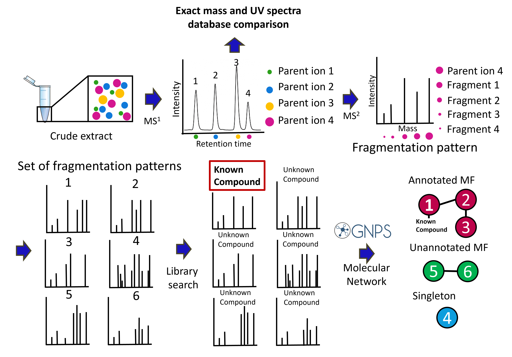
</a>

## Creating a GNPS account

Before starting this tutorial, it will be useful to have a GNPS account. For that go to the [GNPS](https://gnps.ucsd.edu/ProteoSAFe/static/gnps-splash.jsp) webpage and select Create a new account.

<a href="../fig/create_GNPSaccount.jpg">
  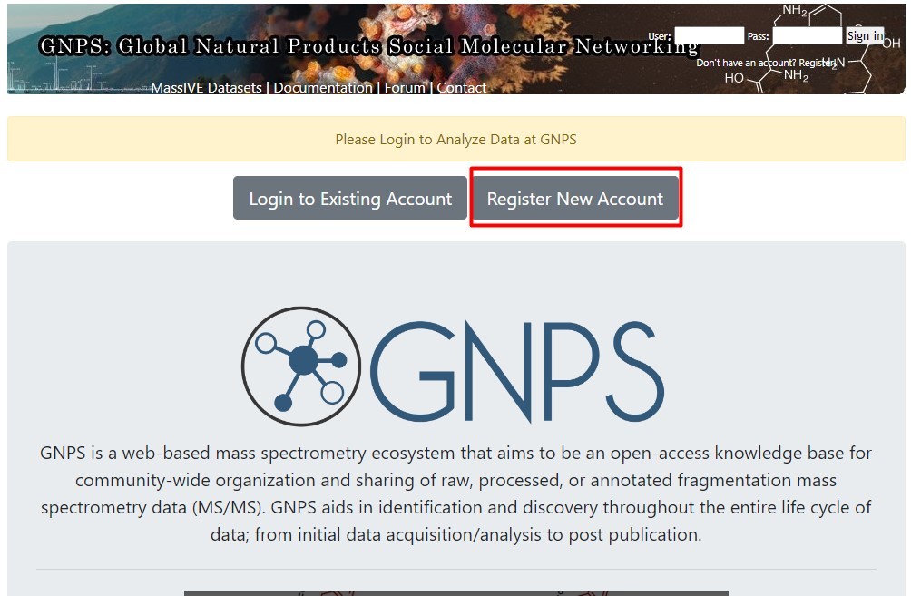
</a>

Then fill in the following information: 

  - Username	
  - Name	
  - Organization	
  - Email	
  - Password

Wait for a confirmation email, and you now have a GNPS account.

## Download MZMine v3.9

1. First, go to the MZMine 3.9 release
[MZMine 3.9](https://github.com/mzmine/mzmine/releases/tag/v3.9.0)

2. Select the installable file depending on your computer

<a href="../fig/Download_MZMine.jpg">
  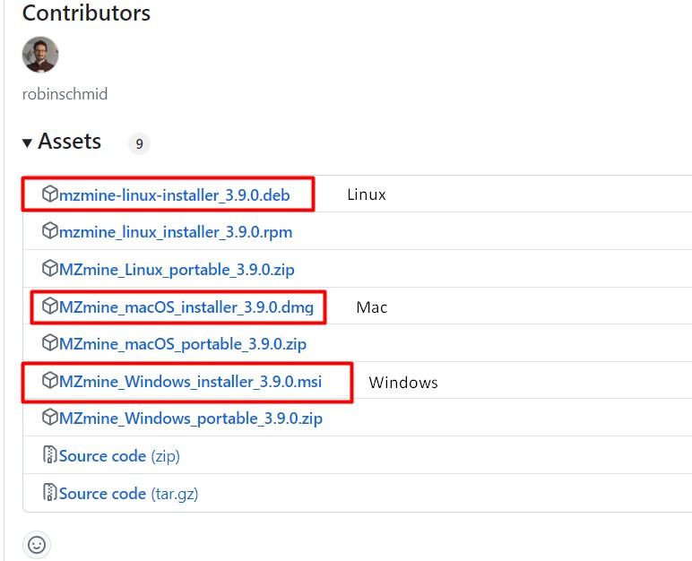
</a>

3. Double-click on the file, and install the software

## Download Cytoscape

Cytoscape is a software frequently used to visualize networks, such as BGC networks or molecular networks. 

1. Go to [Cytoscape webpage](https://cytoscape.org/download.html)

2. Click on download Cytoscape for your operating system

3. Install Cytoscape in your computer.

## Download the metabolomics dataset

First, we need to go to Zenodo and download all the mzML raw data collected from the described strains.
   [https://zenodo.org/api/records/13352458/files-archive](https://zenodo.org/api/records/13352458/files-archive)

After downloading the compressed file, we need to decompress it and store the files in a folder on our computer. 

## Import the dataset, and use the batch file to analyze your data

This data was collected from crude extracts from two marine *Streptomyces*: *Streptomyces* sp. H-KF8, and *Streptomyces* sp. Vc74B-19. 
Two media were used, ISP2 and ISP2 prepared with artificial seawater (ASW), to evaluate the effect of replicating the natural environment from which these strains were isolated. 

<a href="../fig/Datasets.png">
  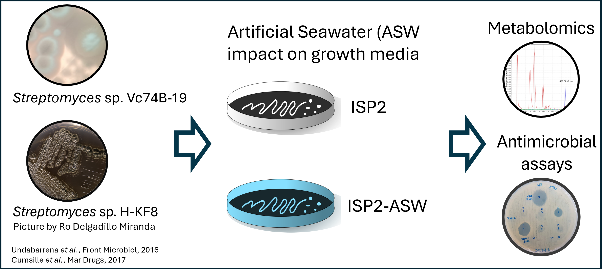
</a>

We downloaded 18 LC-MS/MS-derived files in mzML format. This data was collected by Dr. Mauricio Caraballo-Rodriguez in the Dorrestein Lab, at the University of California San Diego.
There are files from each strain, in ISP2 and ISP2-ASW, besides the crude extracts from the culture media. The data is in triplicates.

Besides mzML files, there is a file metadata_table.tsv, that contains all the relevant information from this dataset. 
Includes the names of the samples, relevant data collection, and taxonomic information. 

In addition, there is information relevant to the analysis, such as the names of the strains, the media used for culturing, and the antimicrobial activity. All this information is included in the format ATTRIBUTE_*

<a href="../fig/Metadata.jpg">
  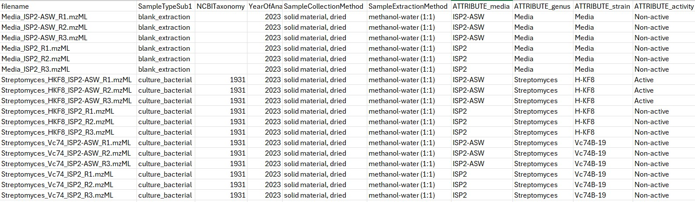
</a>

At last, there is a file named MZMine_FBMN_batch.xml that collects all the information necessary for the analysis using MZMine

## Analysis using MZMine

Load batch file

Open MZMine3, click on "Open", and then in "Batch Mode"

<a href="../fig/batch_01.jpg">
  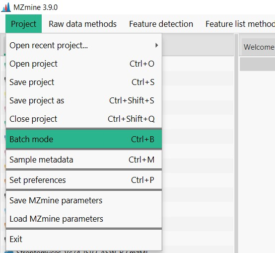
</a>

Here you should select load, and search for your downloaded files on your computer. Then select the MZMine_FBMN_batch.xml file
In confirmation, you should select Replace the batch steps.

<a href="../fig/batch_02.jpg">
  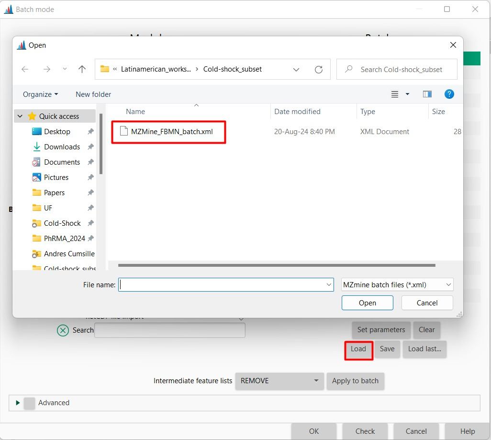
</a>

Then double-click on import MS data

<a href="../fig/batch_03.jpg">
  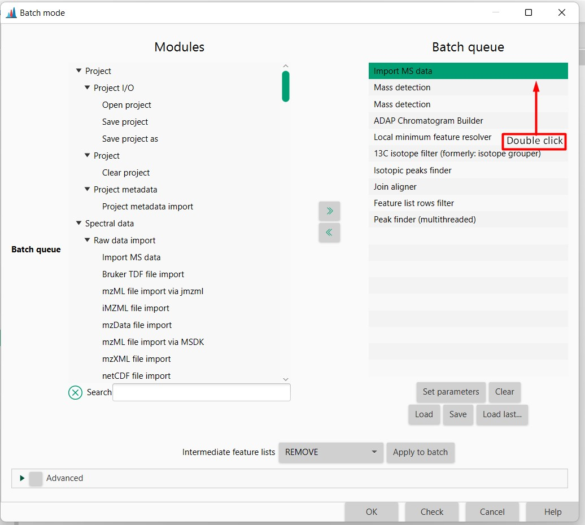
</a>

Select from your computer the 18 mzML files from this dataset

<a href="../fig/batch_04.jpg">
  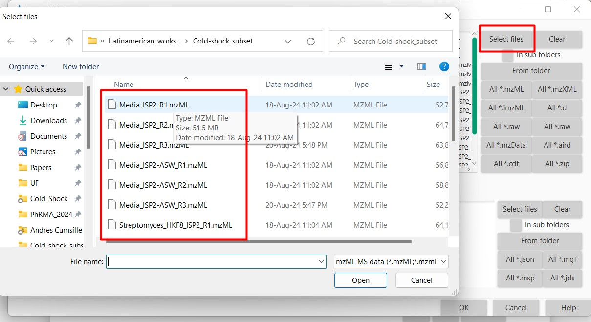
</a>

After this, every file should be included in the batch-processing mode. Select OK afterward so the files begin to process in the meantime.

<a href="../fig/batch_05.jpg">
  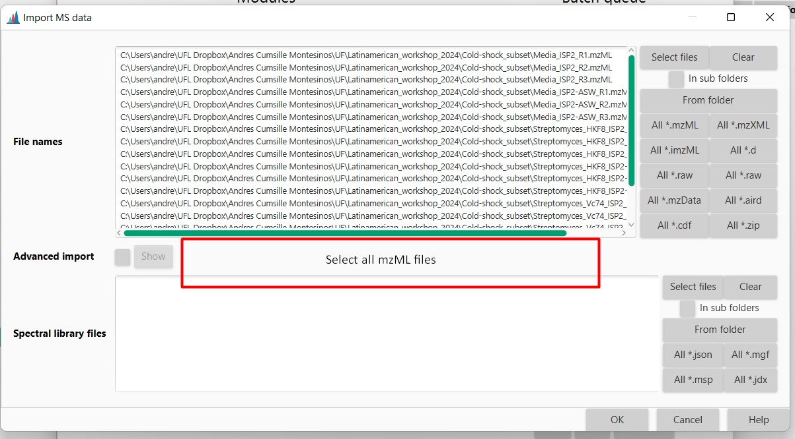
</a>

Briefly, MZMine is now detecting all the masses present in your samples, grouping them, and then aligning them, so you can know in which sample each detected spectrum is present

You should note, that the parameters used are specific for this dataset, you might need to change some of the values when analyzing your own samples.

For more information: 
Nothias, LF., Petras, D., Schmid, R. et al. Feature-based molecular networking in the GNPS analysis environment. Nat Methods 17, 905–908 (2020). https://doi.org/10.1038/s41592-020-0933-6 

## Explore the structure of our data

In the "MS data files" from MZMine you can observe all the 18 LC-MS/MS files in mzML format that we loaded

<a href="../fig/MZMine_datafiles.jpg">
  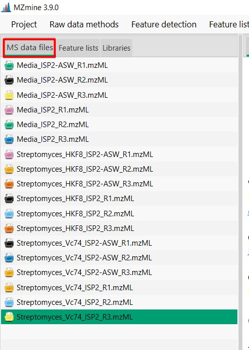
</a>

Let's inspect what the two of these files look like. We could select one file from *Streptomyces* sp. H-KF8 in ISP2, and one in ISP2-ASW
We can select both files, then right-click and select "Show chromatograms"

<a href="../fig/chromatogram_01.jpg">
  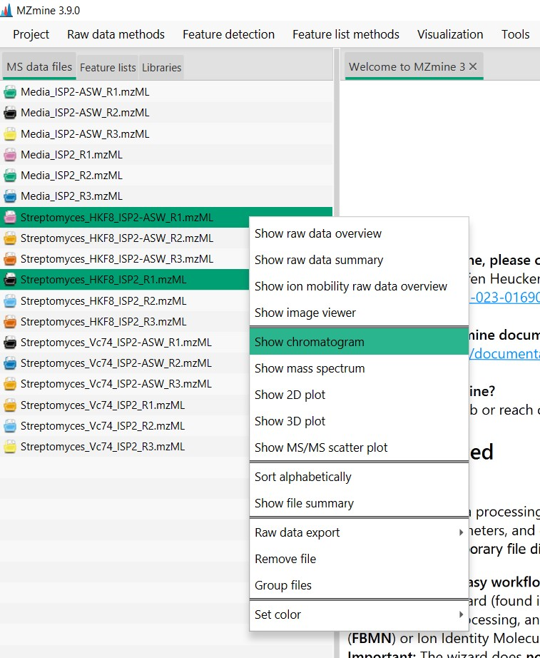
</a>

Here we can select the mass range that we want to observe. Since we want to see all the spectra detected, click "Auto range". It will automatically will select masses ranging from 100 *m/z* to almost 3,749 *m/z*
Click "OK" then

<a href="../fig/chromatogram_02.jpg">
  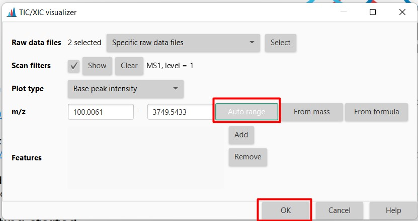
</a>

The software will display the Total Ion Chromatogram (TIC) from both samples. In this case, strain H-KF8 is displayed in pink when cultured in ISP2-ASW, and in black when cultured in ISP2

<a href="../fig/chromatogram_03.jpg">
  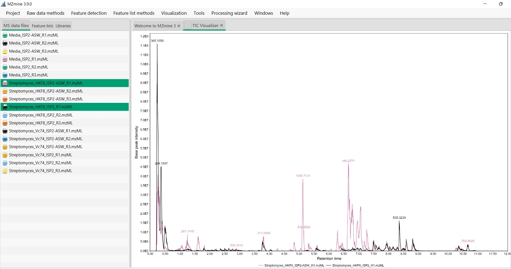
</a>

We can select a section of the chromatogram to inspect the differences of the metabolomic profiles of these samples

<a href="../fig/chromatogram_04.jpg">
  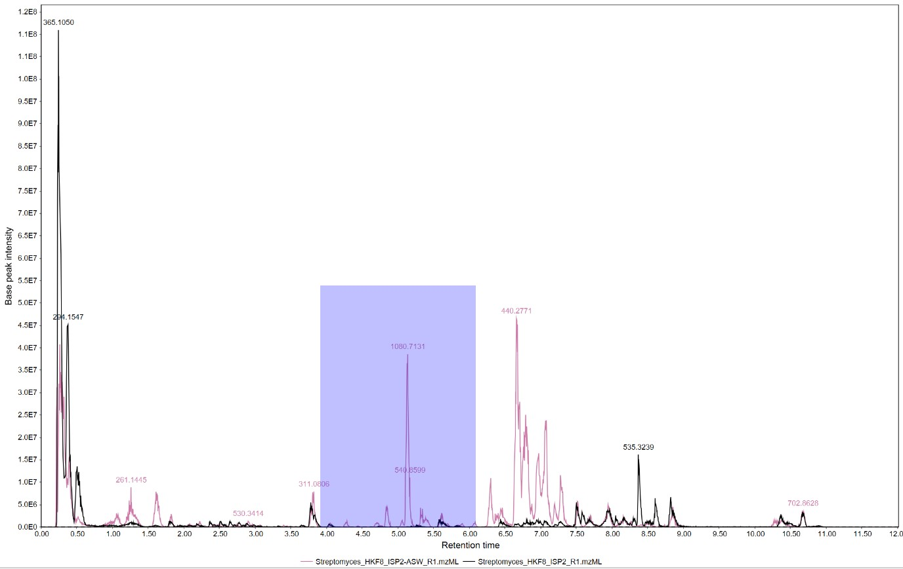
</a>

We can observe that several spectra are produced exclusively by strain H-KF8 in ISP2-ASW

## Analyze the final output from the analysis

After processing all files. We should look at the feature lists tab from MZMine. There we can observe that we have a file called "Aligned feature list 13C gaps". Double-click on that

<a href="../fig/feat_list_01.jpg">
  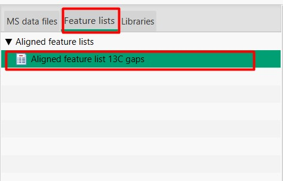
</a>

Here we can observe the feature list, where each row is one detected MS spectra with its *m/z* and retention time (RT). Each column is one of the 18 samples. If MS spectra are detected in a sample, then the height of the peak is displayed in the table

<a href="../fig/feat_list_02.jpg">
  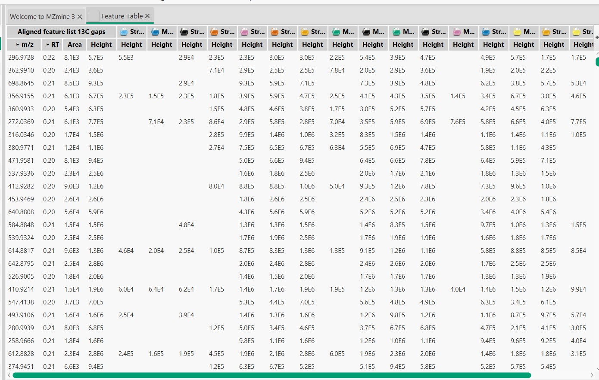
</a>

## Remove media blanks MS spectra

Now we want to remove all the MS spectra that are part of the culture media and not produced by our strains.

For that, we need to go to "Feature List Methods", then click on "Feature List Filtering", and then on "Feature List Blank Subtraction"

<a href="../fig/blank_01.jpg">
  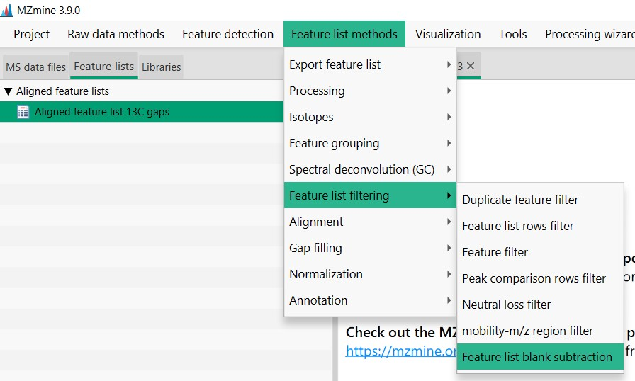
</a>

In the "Blank/Control raw data files" section, we need to select "Specific raw data files", and then select

<a href="../fig/blank_02.jpg">
  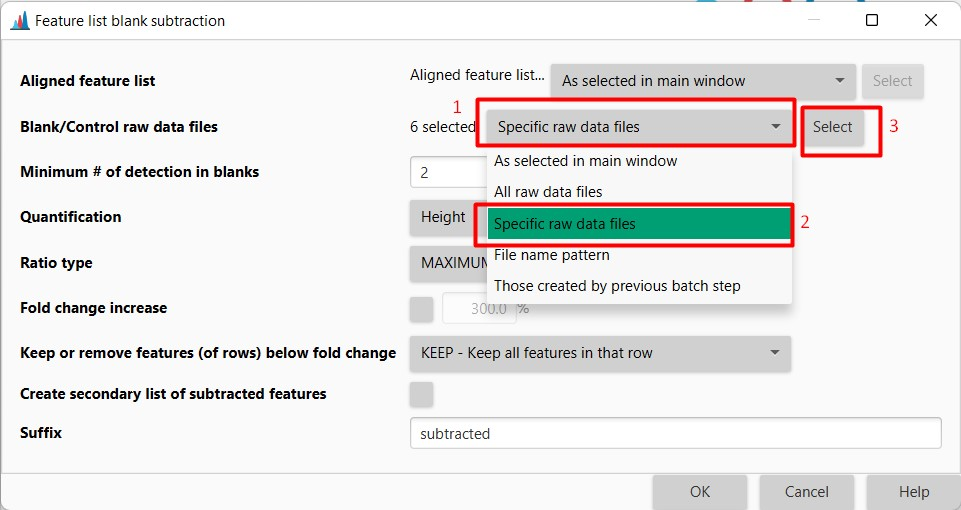
</a>

Here we need to select all the samples that belong to the crude extracts from the Media. There are 6 in total. 
Press OK afterward

<a href="../fig/blank_03.jpg">
  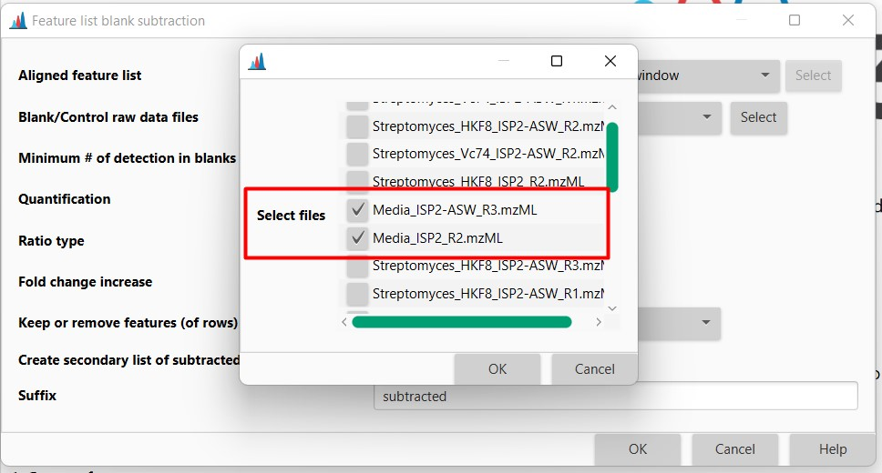
</a>

Now we have two Feature lists
1. Aligned feature list 13C gaps. That is the original feature list including media MS spectra
2. Aligned feature list 13C gaps subtracted. Feature list with media blanks removed

<a href="../fig/blank_04.jpg">
  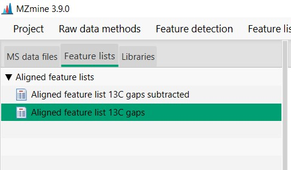
</a>

## Export Feature lists in GNPS format

We are going to export both Feature lists. 

First, select "Aligned feature list 13C gaps".
Then go to "Feature List Methods", "Export Feature List", and select Molecular "networking files"

<a href="../fig/export_01.jpg">
  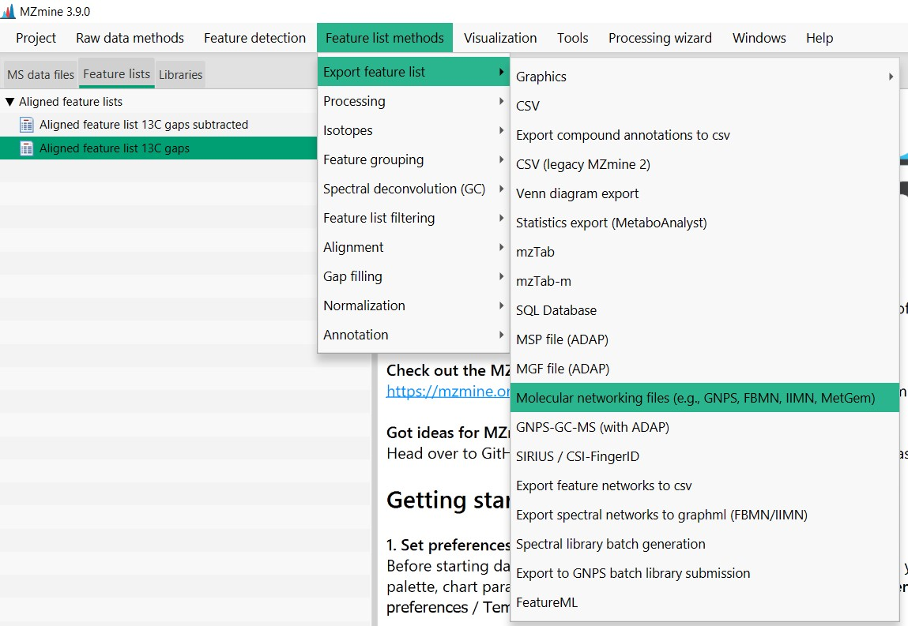
</a>

Then click "Select", and in "File name" write the name that you want your files to be named. In this case, I selected "GM_workshop_Featurelist_complete". So I know that this file is from the Latin American genome mining workshop and that the feature list includes the media blank MS spectra.
then press "save"

<a href="../fig/export_02.jpg">
  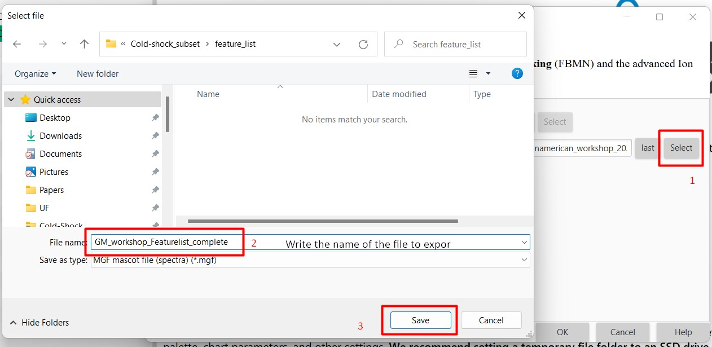
</a>

Make sure that in Filter rows you select "MS2 or ION IDENTITY", so only MS spectra with MS2 are selected.

<a href="../fig/export_03.jpg">
  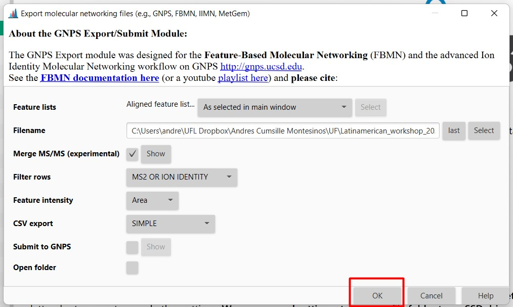
</a>

Then, in your selected folder, you should have two files

1. GM_workshop_Featurelist_complete_quant.csv

  This file is a table that includes all the feature lists in your samples. Again, each row is an MS spectrum, and each column is each of the 18 samples.

2. GM_workshop_Featurelist_complete_quant.mgf

  This file contains the information on each spectrum. Contains the parent mass in *m/z*, and the *m/z* values of each fragment from that spectra, with the peak intensity of each spectrum.

<a href="../fig/export_04.jpg">
  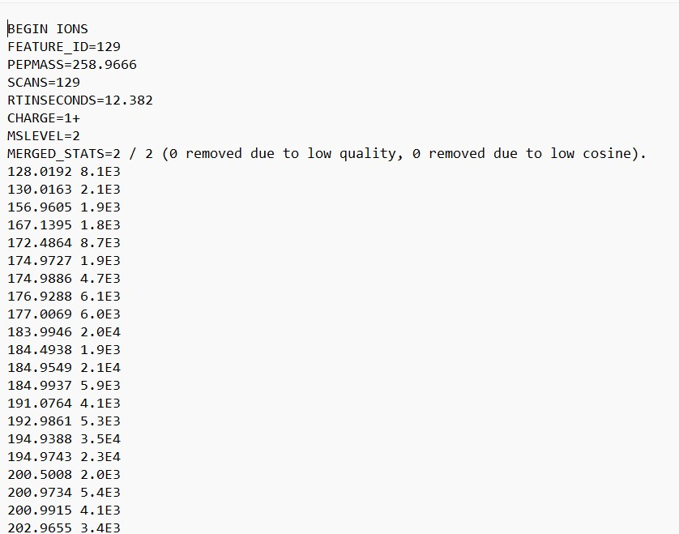
</a>

Now we need to repeat the export step but with the media blanks removed. This time the files will be named "GM_workshop_Featurelist_filtered" so we can know that there is no MS spectra that are originally from the culture media.

After this, we have 4 files. And we are done with the processing steps in MZMine 3

## Create a molecular network

Go into 
[GNPS](https://gnps.ucsd.edu/ProteoSAFe/static/gnps-splash.jsp) webpage 

and login using your username and password

Then we should go to "Advanced Analysis Tools", and Select "Analyze" in the Feature Networking

<a href="../fig/FBMN_01.jpg">
  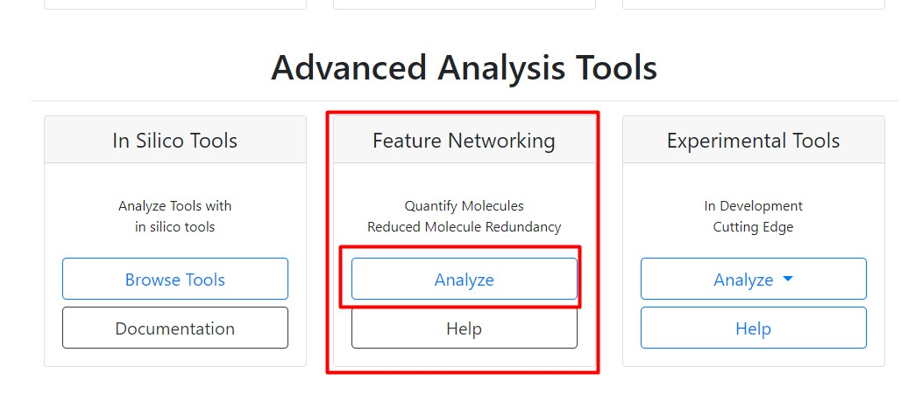
</a>

Then we should write a title for our network. We could use something like "GM_workshop_FBMN_filtered", because we are going to use the feature list with the media blanks removed.

Following that, in "File Selection", click on "Select Input File"

<a href="../fig/FBMN_02.jpg">
  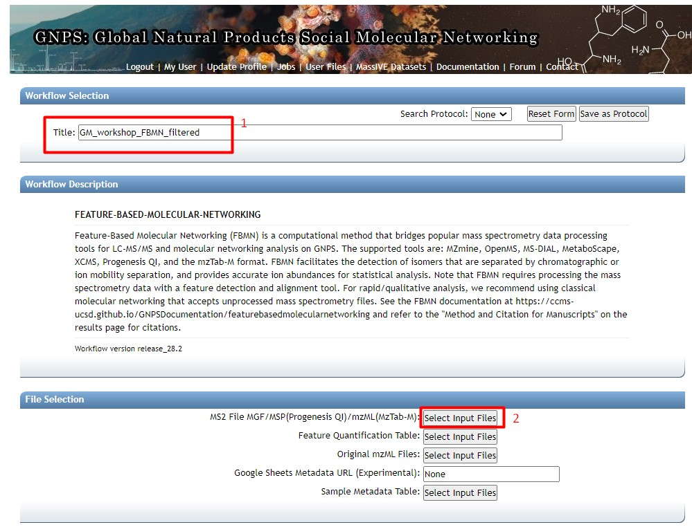
</a>

We now need to upload our feature lists and our metadata table. Click on "Upload files"

<a href="../fig/FBMN_03.jpg">
  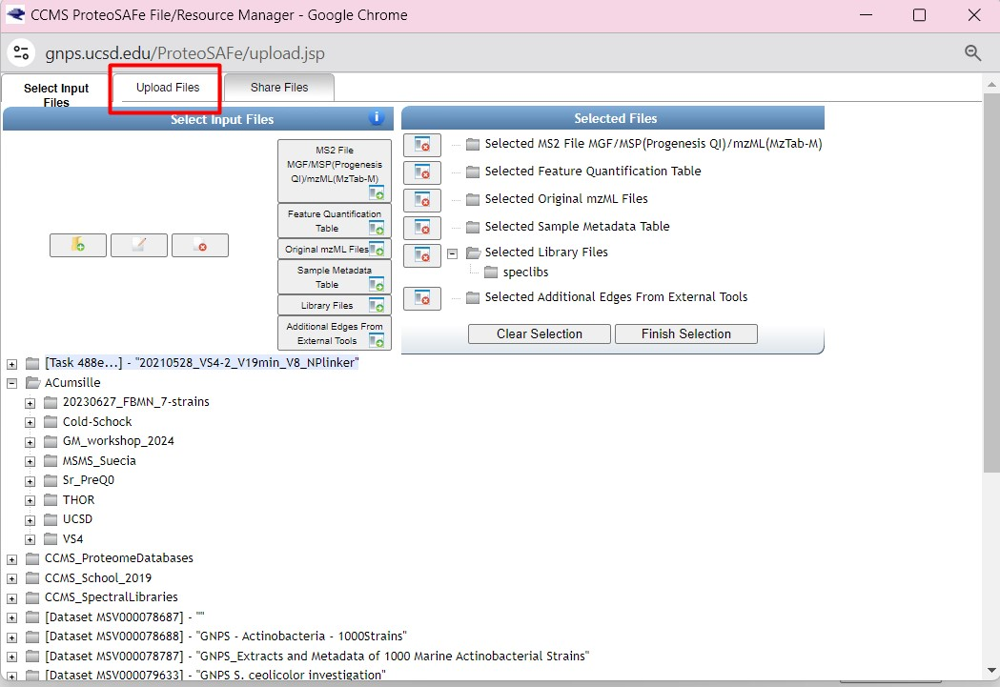
</a>

Here we can create a folder in our GNPS. I created a new folder called "LATAM_GM_workshop". 
Click on that folder. Then in the "File Drag and Drop", drag and drop the following files:
1. GM_workshop_Featurelist_filtered.mgf
2. GM_workshop_Featurelist_filtered_quant.csv
3. metadata_table.tsv

<a href="../fig/FBMN_04.jpg">
  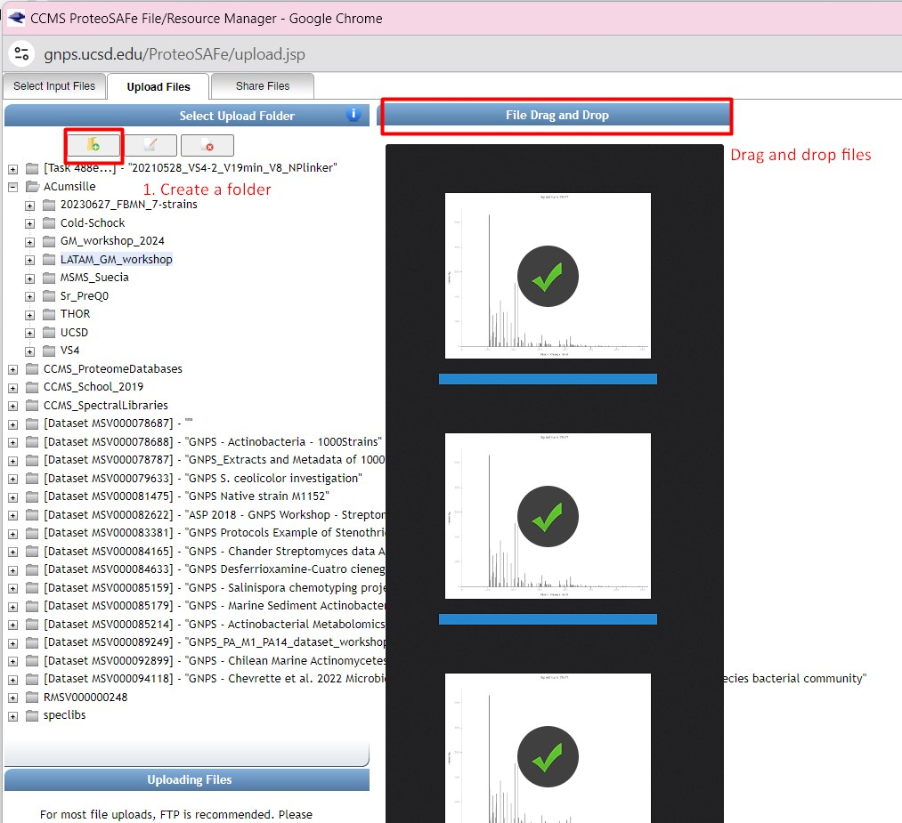
</a>

Return to the "Select Input Files" after uploading your files. You should be able to see the three uploaded files in your directory

<a href="../fig/FBMN_05.jpg">
  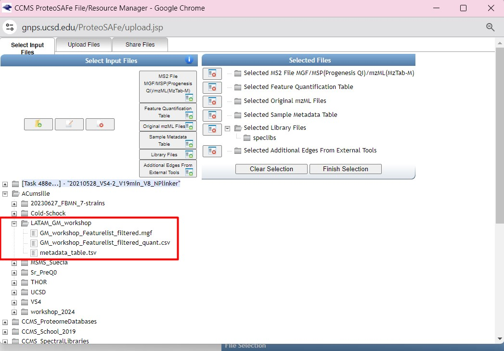
</a>

We are going to select the "GM_workshop_Featurelist_filtered.mgf" file as "MS2 file in MGF format"

<a href="../fig/FBMN_06.jpg">
  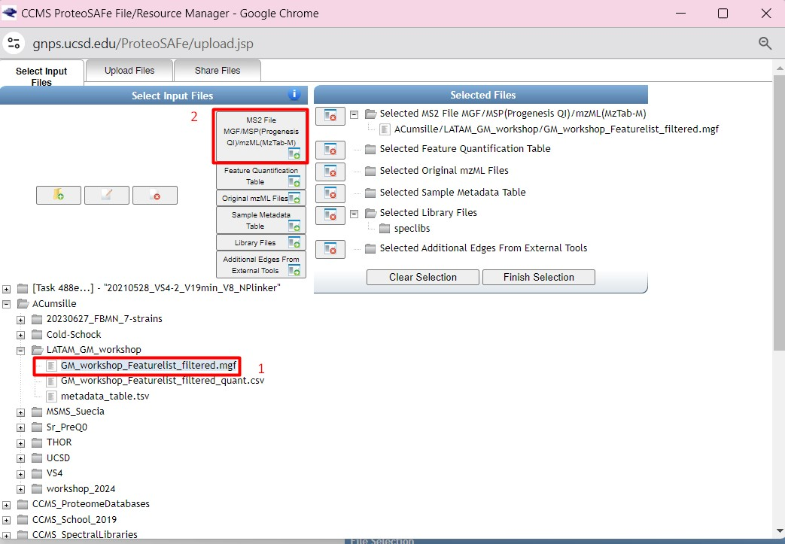
</a>

then we are going to select "GM_workshop_Featurelist_filtered_quant.csv" as the "Feature Quantification Table"

<a href="../fig/FBMN_07.jpg">
  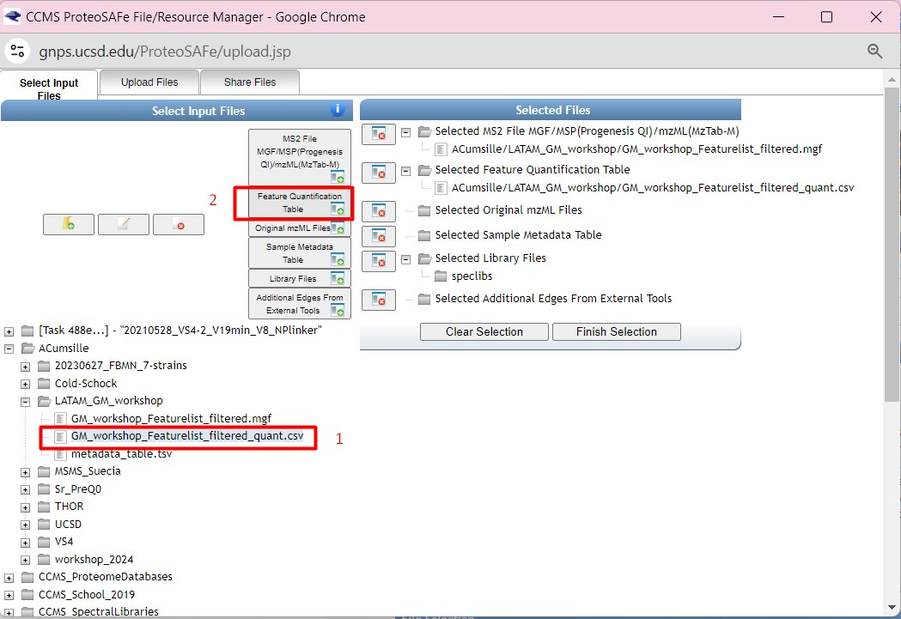
</a>

Finally, we are going to select the "metadata_table.tsv" as our "Sample Metadata Table"

<a href="../fig/FBMN_08.jpg">
  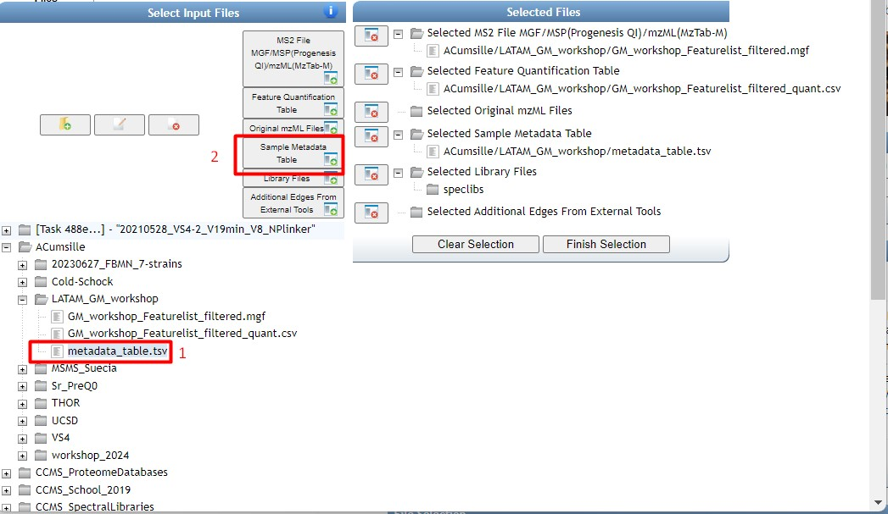
</a>

In the "Selected Files" section, we should be able to see the three files in their corresponding sections.
Click on finish selection after checking everything is ok.

<a href="../fig/FBMN_09.jpg">
  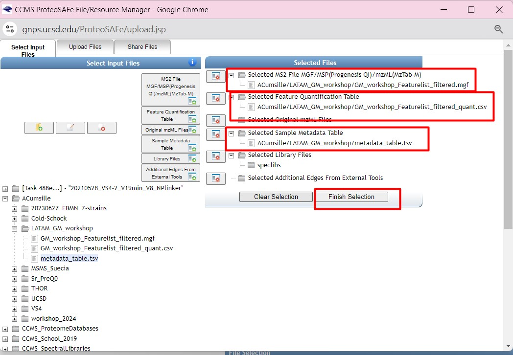
</a>

After selecting the files, we need to adjust the parameters for our network
Since our data was collected using a high-resolution LC-MS/MS, we could adjust the 
- "Precursor Ion Mass Tolerance" to 0.02 Da
    This value affects the clustering of nearly identical MS/MS spectra through MS-Cluster.
- "Fragment Ion Mass Tolerance" to 0.02 Da
    Sets the allowable deviation in m/z values for fragment ions when clustering MS/MS spectra

<a href="../fig/FBMN_10.jpg">
  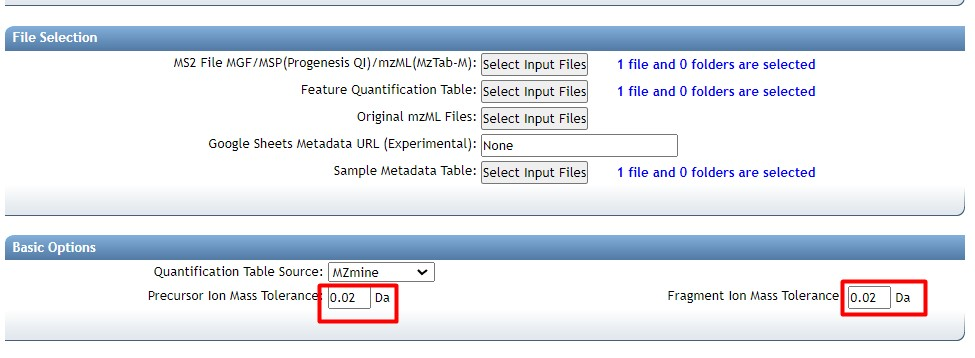
</a>

Then we need to select our thresholds to create the molecular network

- "min pair cos" to 0.7 
    The minimum cosine score required between a pair of consensus MS/MS spectra for an edge to be created in the molecular network.
- "Minimum matched fragment ions" to 6
    Specify the minimum number of common fragment ions that two consensus MS/MS spectra must share to be connected by an edge in the molecular network.

<a href="../fig/FBMN_11.jpg">
  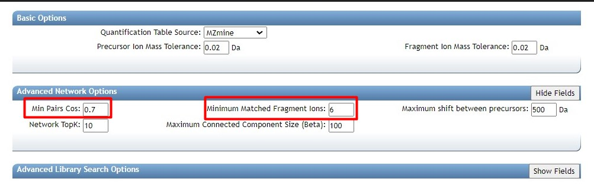
</a>

After this, write your email, so you know when your network is finished. Then click "Submit"

<a href="../fig/FBMN_12.jpg">
  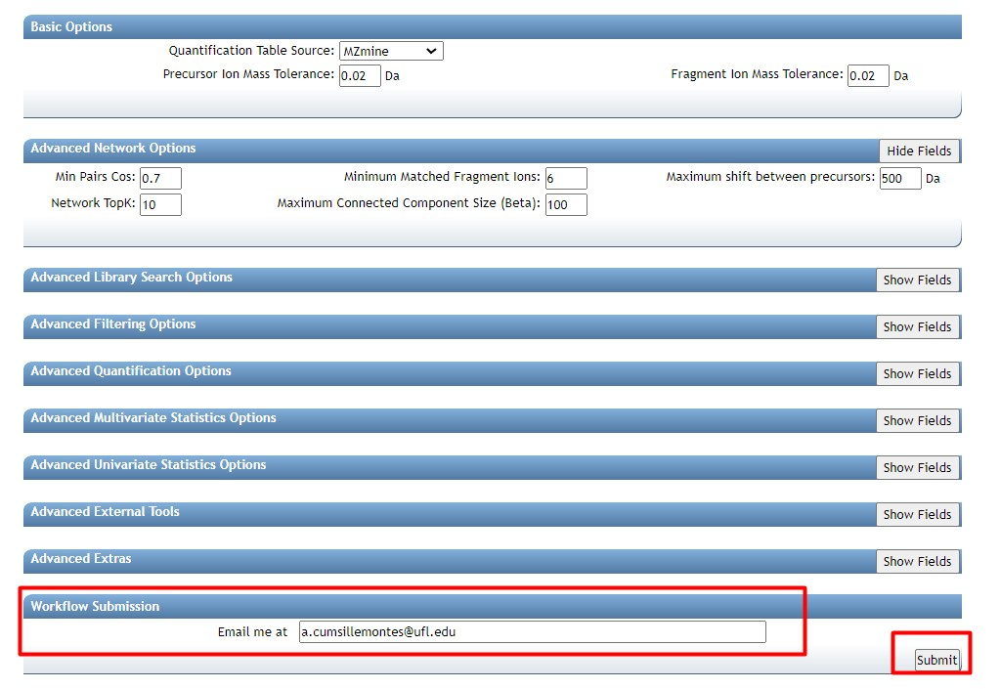
</a>

For more information about the rest of the parameters used for molecular networking:
- [visit the GNPS documentation](https://ccms-ucsd.github.io/GNPSDocumentation/networking/)
- Also visit Aron, A.T., Gentry, E.C., McPhail, K.L. et al. [Reproducible molecular networking of untargeted mass spectrometry data using GNPS.](https://doi.org/10.1038/s41596-020-0317-5) Nat Protoc 15, 1954–1991 (2020).

## Statistics analysis using FBMN STATS guide web server

Now we want to observe how different are the metabolic profiles of our samples. For that, we are going to calculate a Principal Coordinate Analysis (PCoA)

Go into 
[FBMN STATS guide](https://fbmn-statsguide.gnps2.org/)

Select "Data Preparation"

<a href="../fig/FBMN-STATS_01.jpg">
  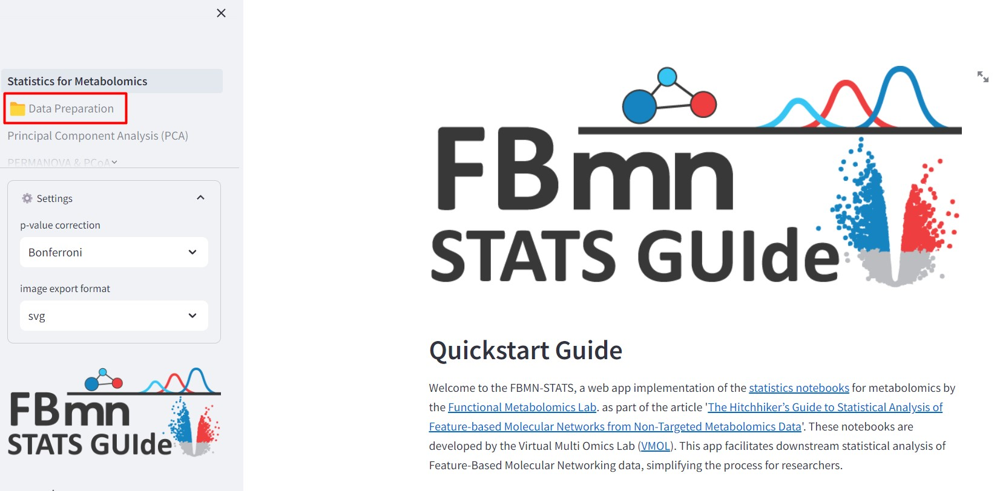
</a>

In file origin select "Quantification table and metadata files". 
- In the Quantification Table section, select the MZMine output file "GM_workshop_Featurelist_complete_quant.csv". This table contains the information of the two strains and the media. We want to observe how different our samples' metabolomic profiles are, in comparison with the culture media. 
- in the Meta Data Table section, include our metadata file "metadata_table.tsv".

<a href="../fig/FBMN-STATS_02.jpg">
  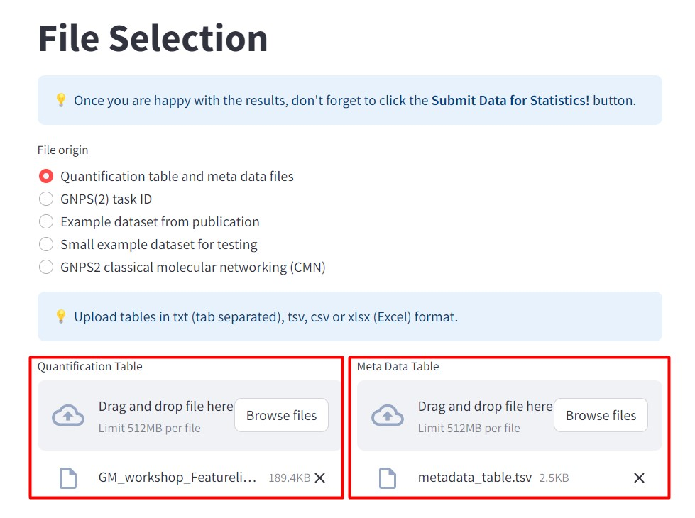
</a>

After loading your files, click "Submit Data for Statistics!".

<a href="../fig/FBMN-STATS_03.jpg">
  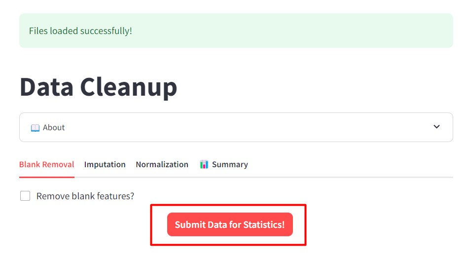
</a>

Check that your data have been properly submitted by checking that you have the "Data preparation was successful!". 

<a href="../fig/FBMN-STATS_04.jpg">
  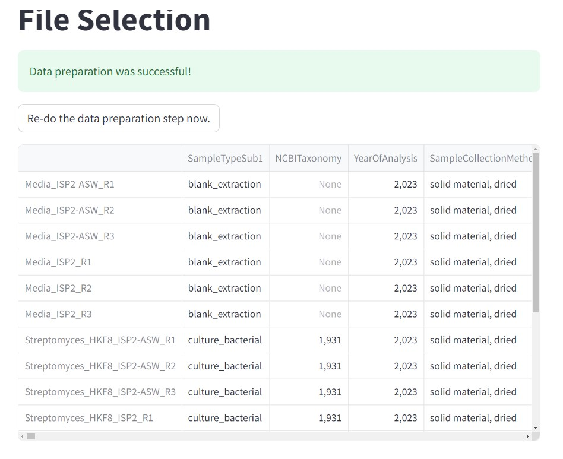
</a>

Now we should go to the "PERMANOVA & PCoA" section.

<a href="../fig/FBMN-STATS_05.jpg">
  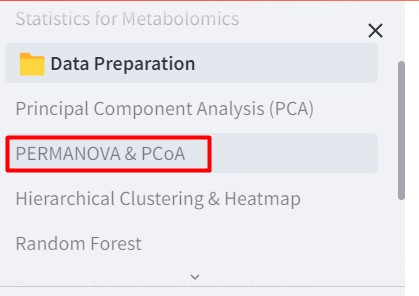
</a>

Select Principal Coordinate Analysis.

<a href="../fig/FBMN-STATS_06.jpg">
  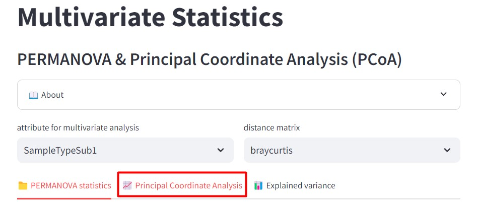
</a>

Now we could change how we want to color our samples.
Select "attribute for multivariate analysis" ATTRIBUTE_media. This will color our samples according to the media (ISP2 or ISP2-ASW)

<a href="../fig/FBMN-STATS_07.jpg">
  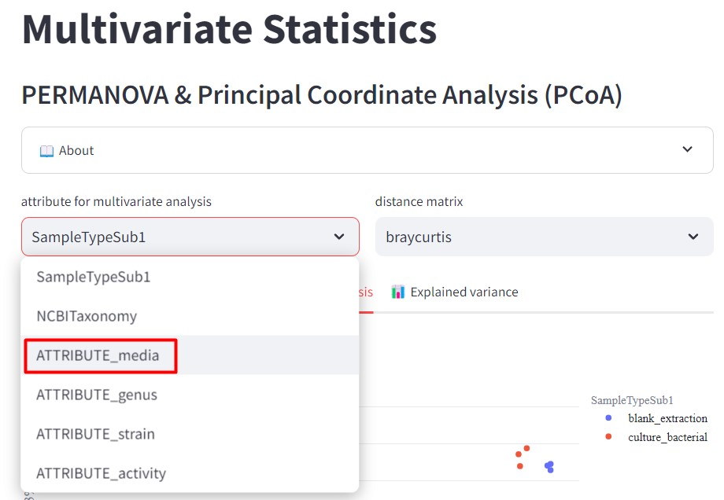
</a>

We can observe that there is a difference between the samples prepared with ISP2 and ISP2-ASW

<a href="../fig/FBMN-STATS_08.jpg">
  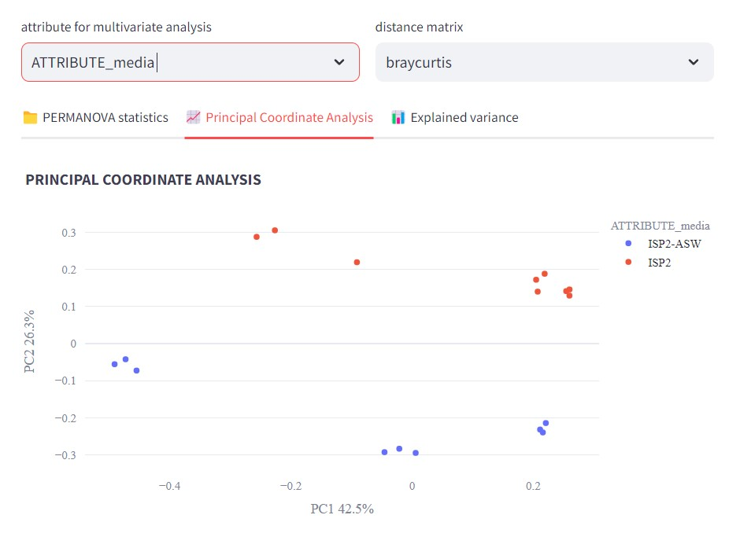
</a>

Now if we color our samples by strain, selecting ATTRIBUTE_strain in "attribute for multivariate analysis"

We can observe that *Streptomyces* sp. Vc74B-19 metabolic profile is quite different than the ones from *Streptomyces* sp. H-KF8 and the culture media. 

Also, it is possible to observe that *Streptomyces* sp. H-KF8 metabolomic profile differs more from the media when cultured in ISP2-ASW

<a href="../fig/FBMN-STATS_09.jpg">
  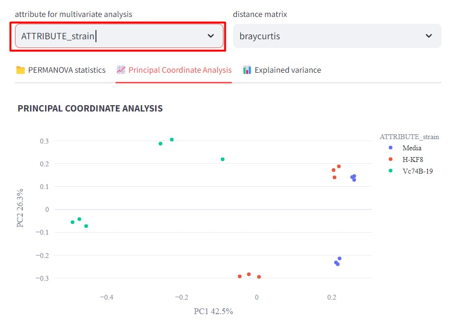
</a>

There are several statistics that you can do using FBMN STATS guide, you can check the preprint [here](https://doi.org/10.26434/CHEMRXIV-2023-WWBT0).

## Visualize the network using Cytoscape

We need to check if our GNPS network is done processing. You might have received an email, otherwise, go to your GNPS account and click on "Jobs"

<a href="../fig/cytoscape_01.jpg">
  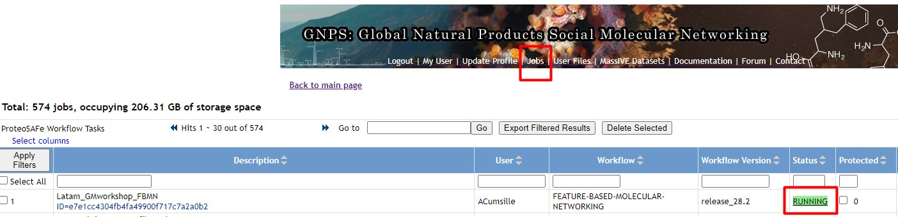
</a>

If your network is Done, then click on it.
Afterward, click on "Direct Cytoscape Preview/Download"

<a href="../fig/cytoscape_02.jpg">
  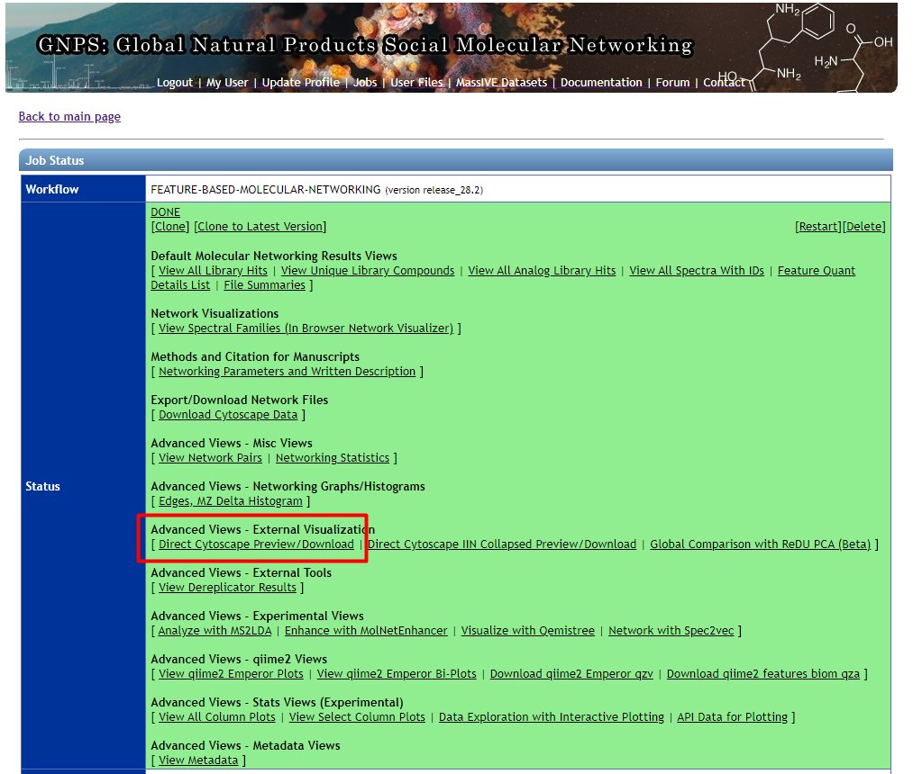
</a>

If your network is not Done, then we could use a previously computed network, that holds the same data that we used in this workshop

[Cytoscape](https://cytoscape.gnps2.org/process?task=568cc93ed2e84f20b2b94bd186b48ee8#{})

Click on "Download Cytoscape File", and save it in your computer

<a href="../fig/cytoscape_03.jpg">
  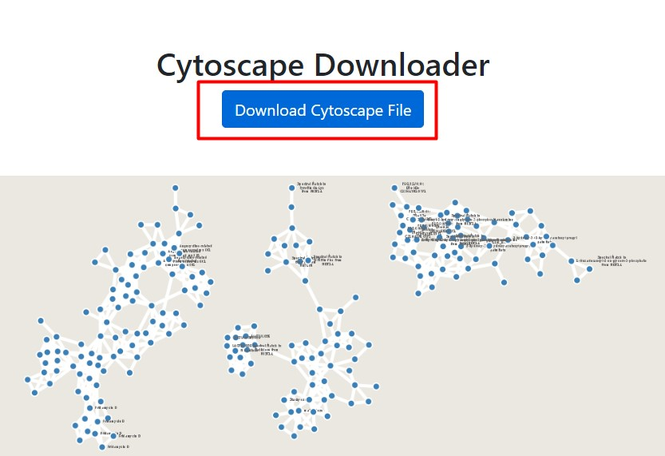
</a>

Open the network on Cytoscape.
We want to change the style of the network and color the nodes according to the strains.
Click on "Style"

<a href="../fig/cytoscape_04.jpg">
  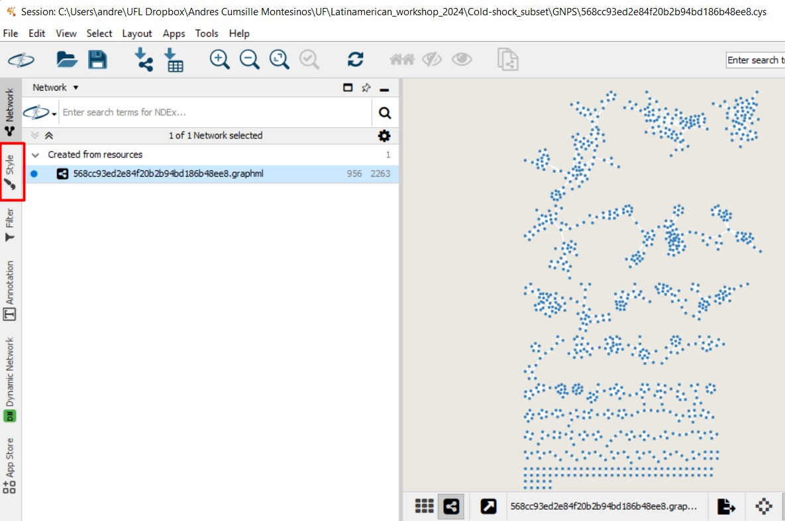
</a>

Select the pie chart icon on Image/Chart. This will help us figure out the abundance of each MS spectra, depending on the metadata parameter that we choose

In this case, we will select the two strains, and also the media
Although we removed all the MS spectra present in the media, there might still be some nodes with MS spectra detected in some of the media samples.

<a href="../fig/cytoscape_06.jpg">
  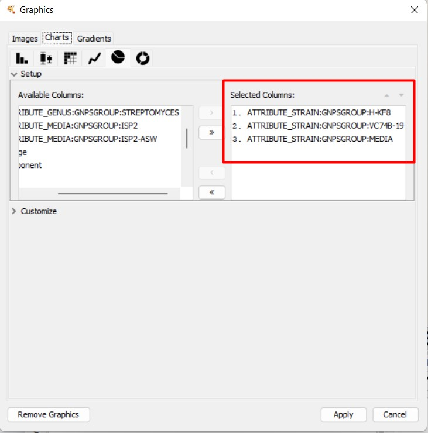
</a>

If we click "Apply", we can observe the nodes present in each strain, and the media. In this case, the light blue means the MS spectra detected in *Streptomyces* sp. Vc74B-19

In this Molecular Family, we can observe some MS spectra with annotations. Some are similar to Urdamycinone B, Dehydroxyaquayamycin, and other Angucycline-related compounds.

<a href="../fig/cytoscape_07.jpg">
  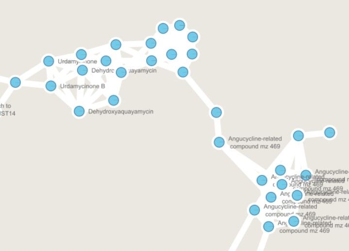
</a>

We can color now the nodes depending on the media where they are detected.
Select the pie chart again in "Image/Chart", and now select ISP2 and ISP2-ASW. This will color ISP2 in red, and ISP2-ASW in light blue

<a href="../fig/cytoscape_08.jpg">
  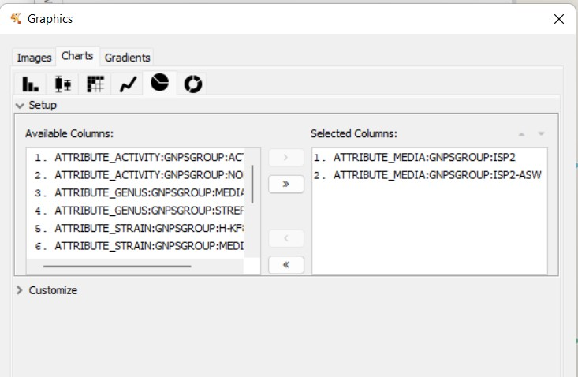
</a>

We can observe that some nodes are detected mostly in ISP2. However, several angucycline-related compounds are detected almost exclusively in ISP2-ASW

<a href="../fig/cytoscape_09.jpg">
  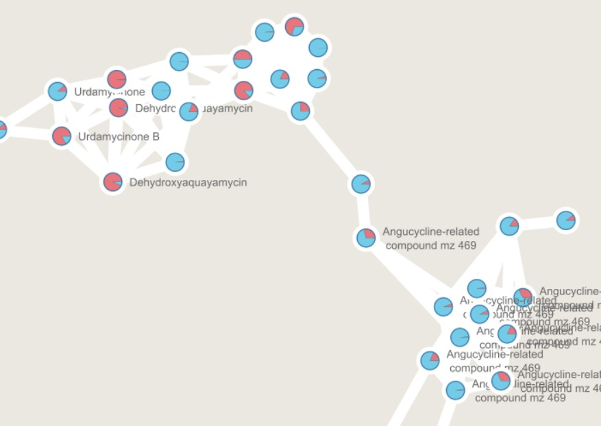
</a>

## References

- Wang, M., Carver, J., Phelan, V. et al. Sharing and community curation of mass spectrometry data with Global Natural Products Social Molecular Networking. Nat Biotechnol 34, 828–837 (2016). https://doi.org/10.1038/nbt.3597.
- Schmid, R., Heuckeroth, S., Korf, A. et al. Integrative analysis of multimodal mass spectrometry data in MZmine 3. Nat Biotechnol 41, 447–449 (2023). https://doi.org/10.1038/s41587-023-01690-2.
- Nothias, LF., Petras, D., Schmid, R. et al. Feature-based molecular networking in the GNPS analysis environment. Nat Methods 17, 905–908 (2020). https://doi.org/10.1038/s41592-020-0933-6
- Aron, A.T., Gentry, E.C., McPhail, K.L. et al. Reproducible molecular networking of untargeted mass spectrometry data using GNPS. Nat Protoc 15, 1954–1991 (2020). https://doi.org/10.1038/s41596-020-0317-5
- Shah, A. K. P., Walter, A., Ottosson, F., Russo, F., Navarro-Díaz, M., Boldt, J., Kalinski, J.-C., Kontou, E. E., Elofson, J., Polyzois, A., González-Marín, C., Farrell, S., Aggerbeck, M. R., Pruksatrakul, T., Chan, N., Wang, Y., Pöchhacker, M., Brungs, C., Cámara, B., … Petras, D. (2023). The Hitchhiker’s Guide to Statistical Analysis of Feature-based Molecular Networks from Non-Targeted Metabolomics Data. ChemRxiv, 1–83. https://doi.org/10.26434/CHEMRXIV-2023-WWBT0

In the future it will include:
- https://www.tfleao.com/general-8, 
- [Paired omics](https://pairedomicsdata.bioinformatics.nl/)
- In the future it will include: SIRIUS: Kai Dührkop, Markus Fleischauer, Marcus Ludwig, Alexander A. Aksenov, Alexey V. Melnik, Marvin Meusel, Pieter C. Dorrestein, Juho Rousu, and Sebastian Böcker, SIRIUS 4: Turning tandem mass spectra into metabolite structure information. Nature Methods 16, 299–302, 2019.

